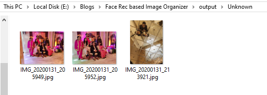

# Face-Recognition-based-Image-Separator
This is a small fun project which uses face recognition techniques to separate images from a large dataset into images of different people according to faces.

  
## Requirements:
Make sure you have already installed the following packages along with python 3.7:
  1. [opencv](https://pypi.org/project/opencv-python/) - Image processing library
  2. [pickle](https://pypi.org/project/pickle5/) - To store encodings
  3. [dlib](https://github.com/davisking/dlib) - ML toolkit for image based tasks
  4. [face_recognition](https://github.com/ageitgey/face_recognition) - Face Recognition api built on dlib

## Files Included:
All the neccessary code is inside [image_segmentation.py](image_segmentation.py) file.

[known_encodings.pickle](known_encodings.pickle) is my people dataset encodings file, you can create your own when you run the code.

## Running the code:
To run the code first add the neccessary images as stated in the getting started section.
After that open command prompt or terminal in your root directory and run the following command:
  ```
  python image_segmentation.py
  ```
Wait and once it's finished, check out the output folder.

## Results:
Once the code is run the output folder looks something like this:


Harshit Folder:


Shreya Folder:


Group Folder:


Unknown Folder:




## License

This project is licensed under the MIT License.


## Acknowledgments

* [Davisking](https://github.com/davisking) for an amazing github repo on dlib
* [Ageitgey](https://github.com/ageitgey) for the face-recognition api package


## References
  
  1. [Siamese Network Paper](https://www.cs.cmu.edu/~rsalakhu/papers/oneshot1.pdf)
  
  2. [Signature Verification using Siamese Networks](http://papers.nips.cc/paper/769-signature-verification-using-a-siamese-time-delay-neural-network.pdf)
  
  3. Images:
      
      * https://www.researchgate.net/figure/Siamese-network-for-embedding-the-feature-maps-into-a-constant-vector_fig2_328376369
      * https://www.researchgate.net/figure/The-Triplet-loss-in-cosine-similarity_fig3_316736728
      * https://omoindrot.github.io/triplet-loss
