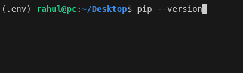
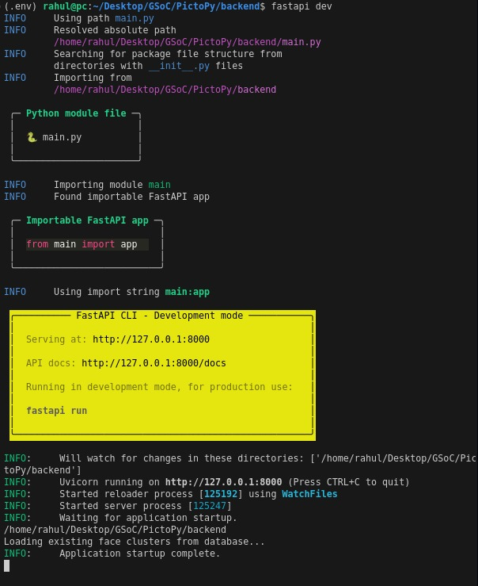

# PictoPy

PictoPy is an advanced desktop gallery application that combines the power of Tauri, React, and Rust for the frontend with a Python backend for sophisticated image analysis and management.

## Architecture

### Frontend

- **Tauri**: Enables building the desktop application
- **React**: Used for creating the user interface
- **Rust**: Powers the backend, which the frontend communicates with through Tauri's API

### Backend (Python)

- **FastAPI**: Serves as the API framework
- **SQLite**: Database for storing metadata and embeddings
- **YOLO**: Used for object detection
- **FaceNet**: Generates face embeddings
- **ONNX Runtime**: Runs the models efficiently
- **DBSCAN**: Performs clustering for face embeddings

### Backend (Rust via Tauri)

Handles file system operations and provides a secure bridge between the frontend and local system.

## Features

- Smart tagging of photos based on detected objects, faces, and their recognition
- Traditional gallery features of album management
- Advanced image analysis with object detection and facial recognition
- Privacy-focused design with offline functionality
- Efficient data handling and parallel processing
- Smart search and retrieval
- Cross-platform compatibility

## Technical Stack

| Component         | Technology           |
| ----------------- | -------------------- |
| Frontend          | React                |
| Desktop Framework | Tauri                |
| Rust Backend      | Rust                 |
| Python Backend    | Python               |
| Database          | SQLite               |
| Image Processing  | OpenCV, ONNX Runtime |
| Object Detection  | YOLOv8               |
| Face Recognition  | FaceNet              |
| API Framework     | FastAPI              |
| State Management  | React Hooks          |
| Styling           | Tailwind CSS         |
| Routing           | React Router         |
| UI Components     | Radix UI             |
| Build Tool        | Vite                 |
| Type Checking     | TypeScript           |

<br>
<details>
<summary style="font-size:20px"> Setup </summary>
<details style ="margin-left:1rem"><summary><h3 style="display: inline;">Setup Using Script (Recommended Approach)</h3></summary>

<div style="margin-left:2rem;">

### Video Setup Guide:

- [Windows](https://youtu.be/nNVAE4or280?si=j_y9Xn8Kra6tPHjw)
- [Ubuntu (Debian)](https://www.youtube.com/watch?v=a7I0ZRE-SHk)

### Prerequisites:

- [NodeJS](https://nodejs.org/en) (LTS Version Recommended)
- [Git](https://git-scm.com/downloads) version control system

### Steps Performed in the Video:

<div>

1. Fork the PictoPy repository: https://github.com/AOSSIE-Org/PictoPy

2. Open your terminal (or Powershell with administrator privileges on Windows)

3. Clone your forked repository:

   ```bash
   git clone https://github.com/yourUsername/PictoPy
   ```

4. Change to the repository directory:

   ```bash
   cd PictoPy
   ```

5. Add the main repository as "upstream":

   ```bash
   git remote add upstream https://github.com/AOSSIE-Org/PictoPy
   ```

6. Run the Automatic Setup

   ```bash
   npm run setup
   ```

   > **Note:** This step can take a long time depending on your internet connection and system specifications. If the script seems to stop progressing after waiting for more than 10 minutes, press Enter in your terminal window to continue.

7. Start the Backend Server

   #### Windows

   ```powershell
   cd .\backend
   .env\Scripts\activate.ps1
   fastapi dev
   ```

   #### Linux

   ```bash
   cd ./backend
   source .env/bin/activate
   fastapi dev
   ```

8. Start the Frontend Desktop App

   Open a new terminal window, navigate to the project directory, and run:

   ```bash
   cd frontend
   npm run tauri dev
   ```

9. Pre-commit Setup

   Before running the `git commit` command, ensure you have the following Python packages installed globally:

   ```bash
   pip install ruff black mypy pre-commit
   ```

   > **Note:** If you are committing from a virtual environment, these packages should already be installed as they are included in the requirements.txt file.

</div>
</div>

</details>

<details style ="margin-left:1rem"><summary><h3 style="display: inline;">Setup Manually</h3></summary>

<div style="margin-left:2rem;">

### Initial Steps:

<div style="margin-left:2rem;">

#### 1. Fork the PictoPy repository: https://github.com/AOSSIE-Org/PictoPy

#### 2. Open your Terminal (Linux/MacOS) or Powershell (Windows)

#### 3. Clone your forked repository:

```bash
git clone https://github.com/yourUsername/PictoPy
```

#### 4. Change to the repository directory:

```bash
cd PictoPy
```

#### 5. Add the main repository as "upstream":

```bash
git remote add upstream https://github.com/AOSSIE-Org/PictoPy
```

</div>

### Tauri Frontend Setup:

<div>

1. **Install Tauri prerequisites based on your OS using this** [guide](https://tauri.app/start/prerequisites/).

2. **Navigate to the Frontend Directory:** Open your terminal and use `cd` to change directories:
   ```
   cd frontend
   ```
3. **Install Dependencies**:
   ```
   npm install
   ```
4. **Start the Tauri desktop app in development mode**
   ```
   npm run tauri dev
   ```

### Python (FastAPI) Backend Setup Steps:

> **Note:** For backend setup make sure that you have **Python version 3.12**. Additionally, for Windows, make sure that you are using Powershell for the setup, not command prompt.

<div>

1.  **Navigate to the Backend Directory:** Open your terminal and use `cd` to change directories:

    Bash

    ```
    cd backend
    ```

2.  **Set Up a Virtual Environment (Highly Recommended):** Virtual environments isolate project dependencies. Create one using:

    Bash(Linux/MacOS)

    ```
    python3 -m venv .env
    ```

    Powershell(Windows)

    ```
    python -m venv .env
    ```

3.  **Activate the Virtual Environment:**

    Bash(Linux/MacOS)

    ```
    source .env/bin/activate
    ```

    Powershell(Windows)

    ```
    .env\Scripts\activate.ps1
    ```

    After activating, you should be able to see the virtual environment's name before the current path. Something like this:

    

4.  **Install Dependencies:** The `requirements.txt` file lists required packages. Install them using pip:

    Bash

    ```
    pip install -r requirements.txt
    ```

5.  **Running the backend:**: To start the backend in development mode, run this command while being in the backend folder and the virtual environment activated:

    Bash/Powershell

    ```
    fastapi dev
    ```

    The server will start on `http://localhost:8000` by default. In test mode, the server will automatically restart if any errors are detected or if source files are modified.

    

6.  **Missing System Dependencies:** Some dependencies might need system-level libraries like `libGL.so.1` (often needed by OpenCV). Install the appropriate packages based on your distribution:

    **Debian/Ubuntu:**

    Bash

    ```
    sudo apt update
    sudo apt install -y libglib2.0-dev libgl1-mesa-glx

    ```

    **Other Systems:** Consult your distribution's documentation for installation instructions.

7.  **`gobject-2.0` Not Found Error:** Resolve this error by installing `libglib2.0-dev` (Debian/Ubuntu):

    Bash

    ```
    sudo apt install -y libglib2.0-dev pkg-config

    ```

    For other systems, consult your distribution's documentation.

</div>
</div>
</details>

<details style ="margin-left:1rem">
<summary> <h3 style="display: inline;">Docker Setup</h3> </summary>
<div style="margin-left:1rem;">

- Docker Compose Setup: [Guide](./docs/docker-compose/redme.md)
- Setup using Dockerfile

  - For setting up the frontend, follow the instructions in the [Frontend Setup Guide](./docs/frontend/docker-setup.md).
    </br>
  - For setting up the backend, follow the instructions in the [Backend Setup Guide](./docs/backend/docker-setup.md).

</div>

</details>

</details>

<details>
<summary> <h2 style="display: inline;">Testing</h2> </summary>

<div style="margin-left:2rem;">

#### Frontend

```bash
cd frontend
npm test
```

#### Backend

- FastAPI
  ```bash
  cd backend
  pytest
  ```
- Tauri

  ```bash
  cd frontend/src-tauri/
  cargo test
  ```

  </div>
  </details>

  <details>
  <summary> <h2 style="display: inline;">Building for Production</h2> </summary>

  <div style="margin-left:2rem;">
  Create Signing Keys for tauri using the command:

```bash
npm run tauri signer generate
```

Set the public key in tauri.conf.json as pubkey and private key and password in Environment Variables as TAURI_SIGNING_PRIVATE_KEY and TAURI_SIGNING_PRIVATE_KEY_PASSWORD

There is a preset pubkey in tauri.conf.json ; private key and password for it is:

```bash
TAURI_SIGNING_PRIVATE_KEY=dW50cnVzdGVkIGNvbW1lbnQ6IHJzaWduIGVuY3J5cHRlZCBzZWNyZXQga2V5ClJXUlRZMEl5NlF2SjE3cWNXOVlQQ0JBTlNITEpOUVoyQ3ZuNTdOSkwyNE1NN2RmVWQ1a0FBQkFBQUFBQUFBQUFBQUlBQUFBQU9XOGpTSFNRd0Q4SjNSbm5Oc1E0OThIUGx6SS9lWXI3ZjJxN3BESEh1QTRiQXlkR2E5aG1oK1g0Tk5kcmFzc0IvZFZScEpubnptRkxlbDlUR2R1d1Y5OGRSYUVmUGoxNTFBcHpQZ1dSS2lHWklZVHNkV1Byd1VQSnZCdTZFWlVGOUFNVENBRlgweUU9Cg==
```

```bash
TAURI_SIGNING_PRIVATE_KEY_PASSWORD=pass
```

```bash
npm run tauri build
```

</div>

</details>

## Additional Resources

- [Tauri Documentation](https://tauri.app/start/)
- [React Documentation](https://reactjs.org/docs/getting-started.html)
- [FastAPI Documentation](https://fastapi.tiangolo.com/)

## Troubleshooting

If you encounter any issues, please check the respective documentation for Tauri, React, and FastAPI. For persistent problems, feel free to open an issue in the project repository.
