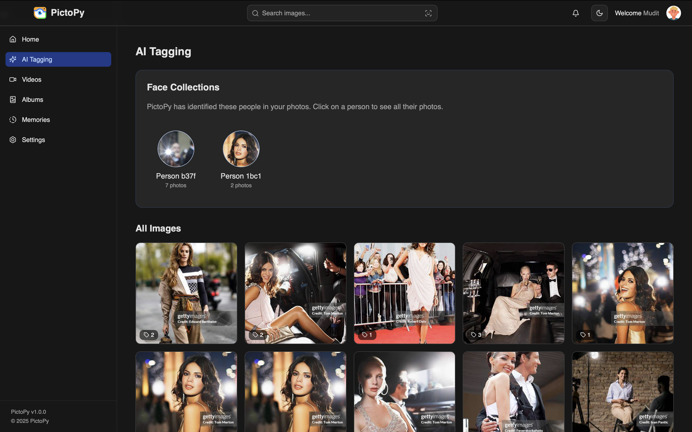
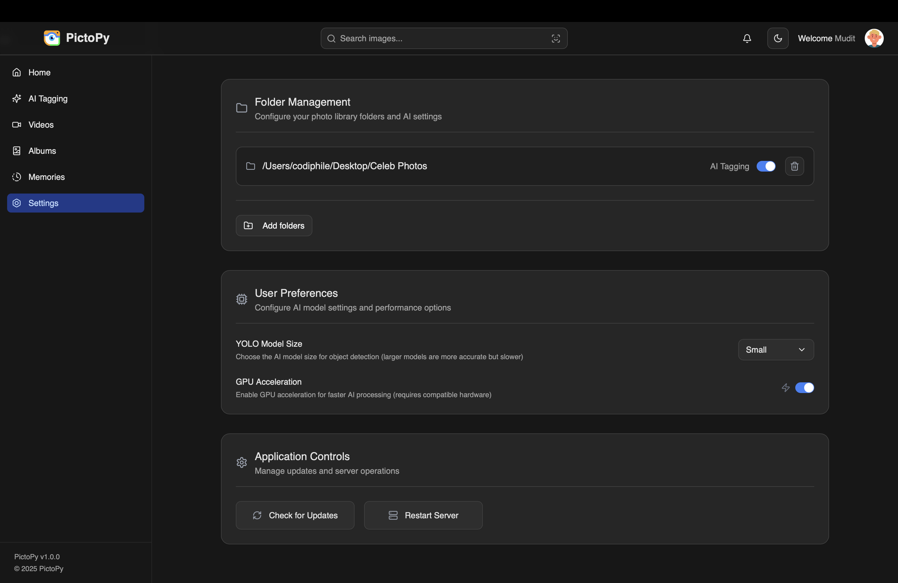

<div align="center">

# 📸 PictoPy

**Your Intelligent Photo Gallery - Powered by AI, Protected by Privacy**

[](LICENSE)
[](https://discord.gg/hjUhu33uAn)
[](https://tauri.app)
[](https://python.org)
[](https://reactjs.org)
[](https://typescriptlang.org)

[Features](#-features) • [Screenshots](#-screenshots) • [Getting Started](#-getting-started) • [Contributing](#-contributing) • [Documentation](#-documentation)

</div>

---

## 🚀 About PictoPy

PictoPy is a **privacy-first, AI-powered desktop gallery application** that revolutionizes how you organize and search through your photo collection. Built with cutting-edge technologies, it combines the speed of Rust, the intelligence of Python AI models, and the elegance of modern web technologies - all while keeping your data **100% offline and secure**.

### ✨ What Makes PictoPy Special?

- 🤖 **AI-Powered Organization** - Automatically detect objects, faces, and scenes in your photos
- 🔒 **Privacy-First** - All processing happens locally. Your photos never leave your device
- ⚡ **Lightning Fast** - Built on Tauri and Rust for exceptional performance
- 🎯 **Smart Search** - Find photos by content, faces, or detected objects instantly
- 🎨 **Beautiful UI** - Modern, intuitive interface built with React and Tailwind CSS
- 🔄 **Cross-Platform** - Works seamlessly on Windows, macOS, and Linux

---

## ✨ Features

### 🖼️ **Intelligent Photo Management**
- **Auto-Tagging**: Automatically tag photos based on detected objects, people, and scenes
- **Face Recognition**: Group photos by detected faces with AI-powered clustering
- **Smart Albums**: Organize your photos with traditional album management tools
- **Advanced Search**: Search by objects, faces, dates, or custom tags

### 🧠 **Powered by State-of-the-Art AI**
- **YOLOv11** for real-time object detection
- **FaceNet** for accurate face recognition and embeddings
- **DBSCAN** clustering for intelligent face grouping
- **ONNX Runtime** for optimized model inference

### 🔐 **Privacy & Performance**
- **100% Offline** - All data stays on your local machine
- **No Cloud Required** - Process images without internet connection
- **Efficient Processing** - Background processing with parallel execution
- **Lightweight Database** - Fast SQLite storage for metadata and embeddings

### 🎨 **Modern User Experience**
- Clean, intuitive interface with dark mode support
- Responsive design that adapts to your workflow
- Real-time updates and smooth animations
- Keyboard shortcuts for power users

---

## 🖥️ Screenshots

<div align="center">

### Home Gallery View


### AI-Powered Tagging


### Settings & Configuration


</div>

---

## 🛠️ Technical Stack

<table>
<tr>
<td width="50%" valign="top">

### Frontend
- **Framework**: React 18 + TypeScript
- **Desktop**: Tauri 2.0
- **Styling**: Tailwind CSS
- **UI Components**: ShadCN UI
- **State Management**: Redux Toolkit
- **Build Tool**: Vite
- **Routing**: React Router

</td>
<td width="50%" valign="top">

### Backend
- **Python API**: FastAPI
- **Rust Backend**: Tauri Core
- **Database**: SQLite
- **AI/ML**: ONNX Runtime, OpenCV
- **Object Detection**: YOLOv11
- **Face Recognition**: FaceNet
- **Async Processing**: asyncio

</td>
</tr>
</table>

---

## 🚀 Getting Started

### Prerequisites

Before you begin, ensure you have the following installed:

- **Node.js** 18+ and npm/yarn
- **Python** 3.11+
- **Rust** 1.70+ (for Tauri)
- **Git**

### Quick Setup

#### Option 1: Automated Setup (Recommended)

**Windows & Ubuntu/Debian:**
```bash
# Clone the repository
git clone https://github.com/yourusername/PictoPy.git
cd PictoPy

# Run setup script
# Windows (PowerShell):
.\scripts\setup.ps1

# Linux/macOS:
./scripts/setup.sh
```

#### Option 2: Manual Setup

For detailed manual setup instructions for all operating systems, see our [Manual Setup Guide](docs/Manual_Setup_Guide.md).

### Running the Application

1. **Start the Python Backend:**
   ```bash
   cd backend
   python main.py
   ```

2. **Start the Frontend (in a new terminal):**
   ```bash
   cd frontend
   npm run tauri dev
   ```

The application will launch automatically!

---

## 📐 Architecture

```
┌─────────────────────────────────────────────────────────────┐
│                     Desktop Application                      │
│  ┌────────────────────────────────────────────────────────┐ │
│  │              React Frontend (TypeScript)               │ │
│  │     • Modern UI Components (ShadCN)                    │ │
│  │     • State Management (Redux)                         │ │
│  │     • Routing & Navigation                             │ │
│  └───────────────────┬────────────────────────────────────┘ │
│                      │ Tauri IPC                             │
│  ┌───────────────────▼────────────────────────────────────┐ │
│  │              Rust Backend (Tauri Core)                 │ │
│  │     • File System Operations                           │ │
│  │     • Secure System Bridge                             │ │
│  │     • Native OS Integration                            │ │
│  └───────────────────┬────────────────────────────────────┘ │
└────────────────────────────────────────────────────────────┘
                       │ HTTP/REST API
┌───────────────────────▼──────────────────────────────────────┐
│                  Python Backend (FastAPI)                     │
│  ┌──────────────┐  ┌──────────────┐  ┌──────────────────┐  │
│  │   AI Models  │  │   Database   │  │  Image Analysis  │  │
│  │  • YOLOv11   │  │    SQLite    │  │    • OpenCV      │  │
│  │  • FaceNet   │  │  • Metadata  │  │    • ONNX        │  │
│  │  • DBSCAN    │  │  • Embeddings│  │    • Processing  │  │
│  └──────────────┘  └──────────────┘  └──────────────────┘  │
└────────────────────────────────────────────────────────────┘
```

---

## 🤝 Contributing

We welcome contributions from developers of all skill levels! Whether you're fixing bugs, adding features, or improving documentation, your help is appreciated.

### How to Contribute

1. **Join our [Discord Server](https://discord.gg/hjUhu33uAn)** (Projects → PictoPy) to connect with the community
2. Check out our [CONTRIBUTING.md](./CONTRIBUTING.md) for detailed guidelines
3. Review our [Code of Conduct](./CODE_OF_CONDUCT.md)
4. Fork the repository and create your feature branch
5. Make your changes and submit a pull request

### Development Workflow

```bash
# 1. Fork and clone the repository
git clone https://github.com/yourusername/PictoPy.git
cd PictoPy

# 2. Create a feature branch
git checkout -b feature/amazing-feature

# 3. Make your changes and test
npm test           # Frontend tests
cd backend && pytest  # Backend tests

# 4. Commit and push
git commit -m "Add amazing feature"
git push origin feature/amazing-feature

# 5. Open a Pull Request
```

### Testing

**Frontend:**
```bash
cd frontend
npm test              # Run tests
npm run test:watch    # Watch mode
```

**Backend:**
```bash
cd backend
pytest                # Run all tests
pytest tests/test_albums.py  # Run specific test
```

**Rust (Tauri):**
```bash
cd frontend/src-tauri
cargo test
```

---

## 📚 Documentation

- 📖 [Full Documentation](https://yourusername.github.io/PictoPy)
- 🔧 [Manual Setup Guide](docs/Manual_Setup_Guide.md)
- 🚀 [Script Setup Guide](docs/Script_Setup_Guide.md)
- 🏗️ [Architecture Overview](docs/overview/architecture.md)
- ✨ [Features Details](docs/overview/features.md)
- 🎨 [Frontend Documentation](docs/frontend/)
- 🐍 [Backend Documentation](docs/backend/)

---

## 🗺️ Roadmap

- [ ] 🎬 Video support and analysis
- [ ] 🌐 Multi-language support
- [ ] 📱 Mobile companion app
- [ ] ☁️ Optional cloud sync (encrypted)
- [ ] 🎨 Custom AI model training
- [ ] 🔍 Advanced similarity search
- [ ] 📊 Photo analytics dashboard
- [ ] 🤝 Shared albums (local network)

---

## 📄 License

This project is licensed under the MIT License - see the [LICENSE](LICENSE) file for details.

---

## 🙏 Acknowledgments

- Thanks to all our [contributors](https://github.com/yourusername/PictoPy/graphs/contributors)
- Built with amazing open-source technologies
- Special thanks to the Tauri, React, and FastAPI communities

---

## 🔗 Links

- 🌐 [Website](https://pictopy.dev) (if available)
- 💬 [Discord Community](https://discord.gg/hjUhu33uAn)
- 🐛 [Issue Tracker](https://github.com/yourusername/PictoPy/issues)
- 📧 [Contact Us](mailto:contact@pictopy.dev)

---

<div align="center">

**Made with ❤️ by the PictoPy Community**

⭐ Star us on GitHub — it helps!

[Report Bug](https://github.com/yourusername/PictoPy/issues) · [Request Feature](https://github.com/yourusername/PictoPy/issues) · [Join Discord](https://discord.gg/hjUhu33uAn)

</div>
