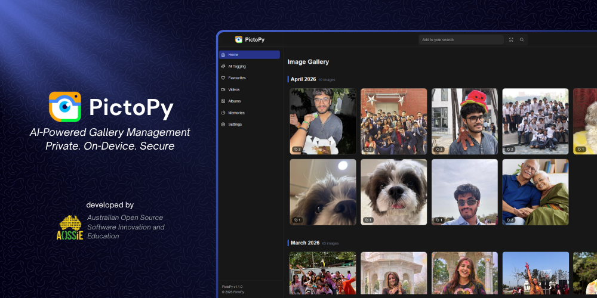
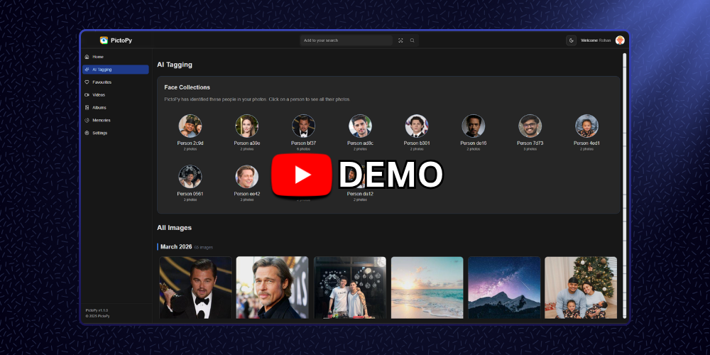
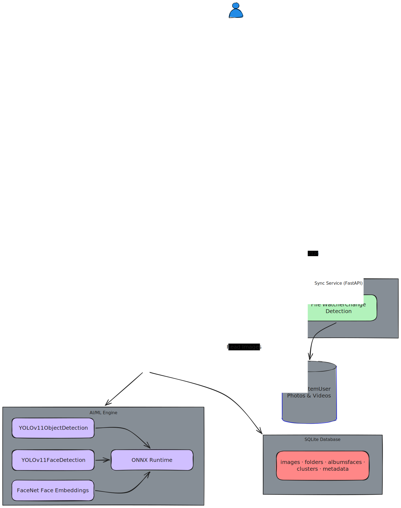

<!-- Don't delete it -->

  

<!-- Organization/Project Social Handles -->

<!-- Telegram -->

&nbsp;&nbsp;
<!-- X (formerly Twitter) -->

&nbsp;&nbsp;
<!-- Discord -->

&nbsp;&nbsp;
<!-- Medium -->

&nbsp;&nbsp;
<!-- LinkedIn -->

&nbsp;&nbsp;
<!-- Youtube -->

# PictoPy

**PictoPy is an open-source, privacy-first AI photo management application built for the desktop - featuring on-device face recognition, object detection, and smart search, with zero data leaving your machine.**

PictoPy brings the intelligence of modern AI photo management to your local machine, without the privacy trade-offs of cloud-based alternatives. Built as a fully offline desktop application with Rust, React, and Python, PictoPy automatically groups faces across your library, tags photos with detected objects, and lets you search your pictures with simple words - all powered by state-of-the-art on-device models, without an internet connection or a subscription.

Find out more at [https://pictopy.aossie.org/](https://pictopy.aossie.org/).

## Features

**AI-powered**
* Smart tagging based on detected faces and objects
* Advanced image analysis with object detection and facial recognition
* Smart search and retrieval

**Gallery management**
* Album management with traditional gallery features
* Cross-platform compatibility

**Privacy & performance**
* Privacy-focused design with fully offline functionality
* Efficient data handling and parallel processing

## Demonstration

  

## Technology Stack

| Component         | Technology           |
| ----------------- | -------------------- |
| Frontend          | React                |
| Desktop Framework | Tauri                |
| Backend           | Rust, Python         |
| Database          | SQLite               |
| Image Processing  | OpenCV, ONNX Runtime |
| Object Detection  | YOLOv11              |
| Face Recognition  | FaceNet              |
| API Framework     | FastAPI              |
| State Management  | Redux Toolkit        |
| Styling           | Tailwind CSS         |
| Routing           | React Router         |
| UI Components     | ShadCN               |
| Build Tool        | Vite                 |
| Type Checking     | TypeScript           |

## High Level Architecture

  <picture>
    <source media="(prefers-color-scheme: dark)" srcset="docs/assets/architectual-design-dark.svg">
    <source media="(prefers-color-scheme: light)" srcset="docs/assets/architectual-design-light.svg">
    
  </picture>

## Want to Contribute?

1. First, join the **[Discord Server](https://discord.gg/hjUhu33uAn) (Go to Projects->PictoPy)** to chat with everyone.
2. For detailed setup instructions, coding guidelines, and the contribution process, please check out our [CONTRIBUTING.md](./CONTRIBUTING.md) file.

Don't forget to star this repository if you find it useful! ⭐

Our Code of Conduct: [CODE_OF_CONDUCT.md](./CODE_OF_CONDUCT.md)

## License

This project is licensed under the GNU General Public License v3.0.
See the [LICENSE](LICENSE) file for details.

## Thanks To All Contributors

Thanks a lot for spending your time helping TODO grow. Keep rocking 🥂

© 2026 AOSSIE