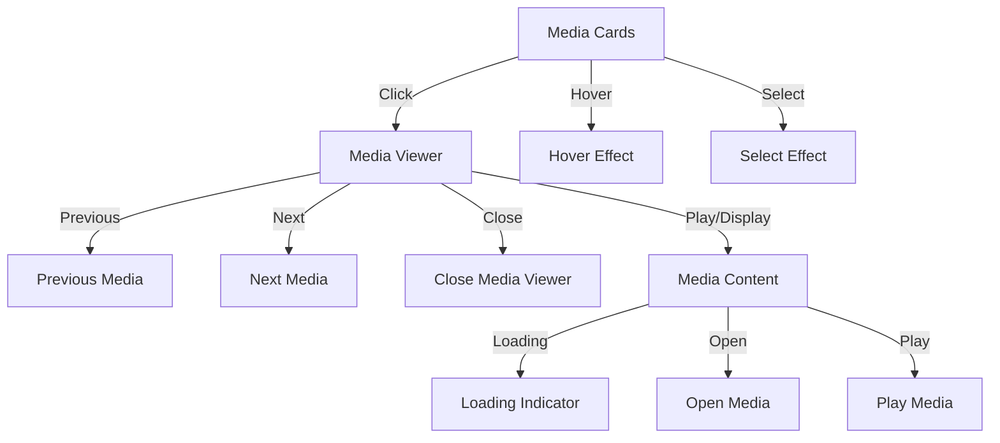
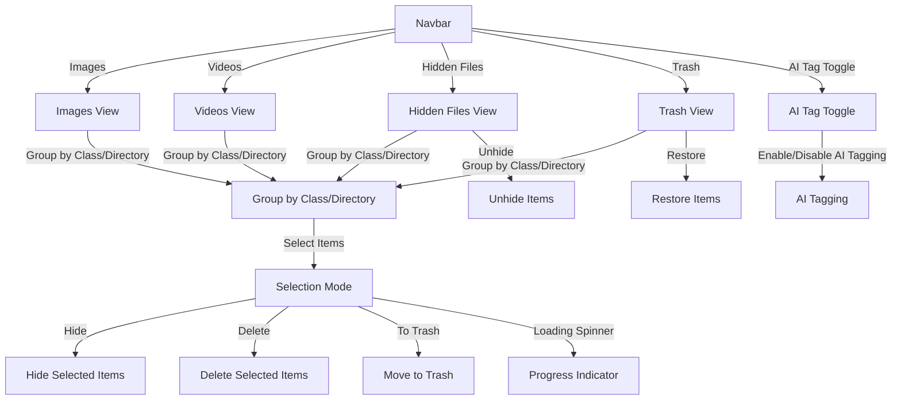

### Components
- **[Main Content Area](./frontend/#media-content-area)**: Displays media based on clicked section.
- **[Navigation](./frontend/#navigation-flow)**: Contains navigation links and action buttons.

### Media Content Area
> The Main Media Component is crucial for displaying media content such as images and videos. The design should handle various user interactions including opening/playing media, navigating between media, and closing the media view.

**Components:**
- **Media Cards**: Display media thumbnails.
- **Media Viewer**: Displays the selected media with controls.
- **Navigation Controls**: Includes previous, next, and close buttons.

#### Visual Flow

## Navigation Flow

### AI Tagging Toggle

  - **Enabled**: Classify media by category. (will take long for the first time)
  - **Disabled**: 
    - Groups by directory. (Default)
    - This should be similar to **Albums**, where creating a new album means creates new directory with desired images.
  - **Toggles routes**: between `/class` and `/directory`

### Images

1. **Viewing Images:**
   - By default, the application shows recent images or images grouped by directory.
   - Use the navbar to switch between directory and class-based views.

2. **Selecting Images:**
   - Click on the “Select” button in the navbar to enable selection mode.
   - Click on individual images to select them.

3. **Performing Actions:**
   - After selecting images, choose the desired action (e.g., hide, delete) from the navbar.

### Videos

1. **Viewing Videos:**
   - Similar to images, but with video files. Toggle between class and directory views as needed.

2. **Selecting Videos:**
   - Enable selection mode and select videos as required.

3. **Performing Actions:**
   - Use the navbar options to apply actions to selected videos.

### Hidden Files

1. **Viewing Hidden Files:**
   - Access hidden files via the navbar and choose to view by class or directory.

2. **Selecting Hidden Files:**
   - Enable selection mode and select files for management.

3. **Performing Actions:**
   - Options include unhide, delete, or move to trash.

### Trash

1. **Viewing Trash:**
   - Shows all files moved to Trash. You can view them grouped by class or directory.
   - All files here gets permanently deleted after 30 days of being added.

2. **Selecting Trash Files:**
   - Select files to restore or permanently delete.

3. **Performing Actions:**
   - Choose restore to return files to their original location or delete for permanent removal.

### Selection Mode

- **Enable/Disable Select Mode:** Toggles the ability to select multiple media items for bulk actions.
- **Select:** Click the card.
- **Deselect:** Click again.

**Actions After Selecting Media:**

1. **Hide:**
   - Route: `/hide`
   - Description: Hides the selected media files, making them invisible in the default views.
   
2. **Delete:**
   - Route: `/delete`
   - Description: Permanently removes the selected media files from the database and storage.

3. **To Trash:**
   - Route: `/toTrash`
   - Description: Moves the selected media files to the Trash section for potential restoration or permanent deletion later.

4. **Restore:**
   - Route: `/restore`
   - Description: Restores selected files from Trash back to their original location.

1. **Unhide:**
   - Route: `/unhide`
   - Description: Hides the selected media files, making them invisible in the default views

---

#### Visual Flow

