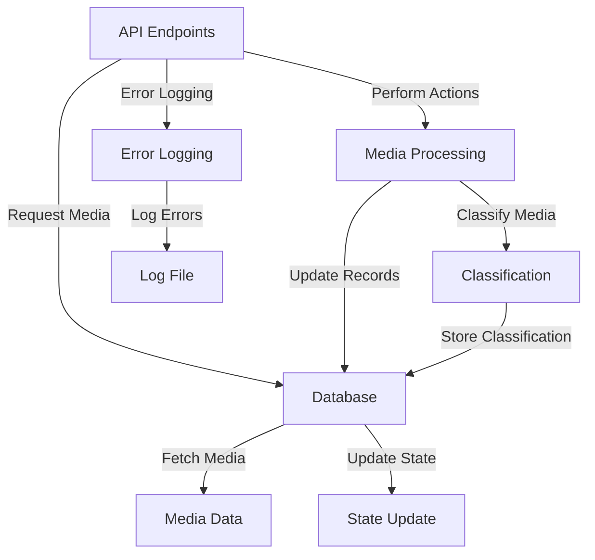

The backend is responsible for handling data operations, processing requests, and interacting with the database. This includes retrieving media, managing selections, processing hide/delete operations, and serving the media content.

### Backend Overview

**Components:**
- **API Endpoints**: Handles requests for media retrieval, actions (hide, delete), and navigation.
- **Database**: Stores media metadata, file paths, and state (e.g., hidden, deleted).
- **Media Processing**: Handles media operations, such as fetching, classifying, and updating records.
- **Error Logging**: Captures and logs errors for debugging and monitoring.

### Visual Flow of BackEnd



### Detailed Backend Component Behavior

**1. API Endpoints:**
- **Handles Requests:**
  - **Media Retrieval:** Provides media data based on requests (e.g., `/img/class`, `/vid/directory`).
  - **Actions (Hide/Delete):** Processes actions requested by the frontend (e.g., `/hide`, `/delete`).
  - **Selection Management:** Manages media selection states (e.g., `/select`).

**2. Database:**
- SQLite is being used for DB
  - As the app is local-first.
  - DB is operated in ***WAL-mode**, for independent read operations.
- **Stores:**
  - **Media Metadata:** File paths, types, and associated metadata.
  - **State:** Hidden status, deleted status, and timestamps for actions.
- **Operations:**
  - **Fetch Media:** Retrieves media records based on filters or criteria.
  - **Update State:** Updates media records to reflect changes like hiding or deletion.
- **Schema**
```mermaid
erDiagram
    MEDIA {
        INTEGER mediaID PK "Primary Key"
        TEXT hash "Unique Hash"
        TEXT path "File Path"
        TEXT directory "Directory"
        TEXT fileType "File Type"
        TIMESTAMP modifiedTime "Modification Timestamp"
        INTEGER hidden "Hidden Flag"
    }

    CLASS {
        INTEGER classID PK "Primary Key"
        TEXT class "Class Name"
    }

    JUNCTION {
        INTEGER mediaID FK "Foreign Key to MEDIA"
        INTEGER classID FK "Foreign Key to CLASS"
    }

    %% Define relationships
    JUNCTION ||--o| MEDIA : contains
    JUNCTION ||--o| CLASS : belongsTo

```

**3. Media Processing:**
- **Classify Media:** Classifies media based on predefined criteria or user input.
- **Update Records:** Updates the database with new classification information or action results.

**4. Error Logging:**
- **Captures Errors:** Logs errors encountered during API operations or media processing.
- **Stores Logs:** Saves error information to a log file in `~/.pictopy`, for monitoring and debugging.

### Example User Interaction Flow

1. **Request Media:**
   - **API Call:** Frontend requests media using endpoints (e.g., `/img/class`).
   - **Database Query:** Retrieves media data from the database.
   - **Response:** Sends media data back to the frontend.

2. **Perform Actions:**
   - **Hide/Delete Request:** Frontend requests to hide or delete selected media.
   - **Media Processing:** Updates the state of media items in the database.
   - **Response:** Sends confirmation or updated data back to the frontend.

3. **Selection Management:**
   - **Select Media:** Updates selection state based on user actions.
   - **Bulk Actions:** Applies actions to selected media (e.g., hide or delete).

### Detailed Flow for Media Retrieval and Actions

**1. Media Retrieval:**
- **Request:** The frontend makes an API call to retrieve media (e.g., `/img/class`).
- **Database Query:** The backend queries the database for the required media.
- **Response:** The backend sends the media data in JSON format to the frontend.

**2. Hide/Delete Actions:**
- **Request:** The frontend sends a request to hide or delete media (e.g., `/hide` or `/delete`).
- **Media Processing:** The backend updates the media state in the database (e.g., set `hidden` flag).
- **Response:** The backend confirms the action and updates the frontend.

**3. Selection and Bulk Actions:**
- **Selection:** The frontend sends the selected media paths to the backend.
- **Bulk Action Request:** The backend processes actions like hide or delete on selected media.
- **Update Records:** The database is updated with new states for the selected media.
