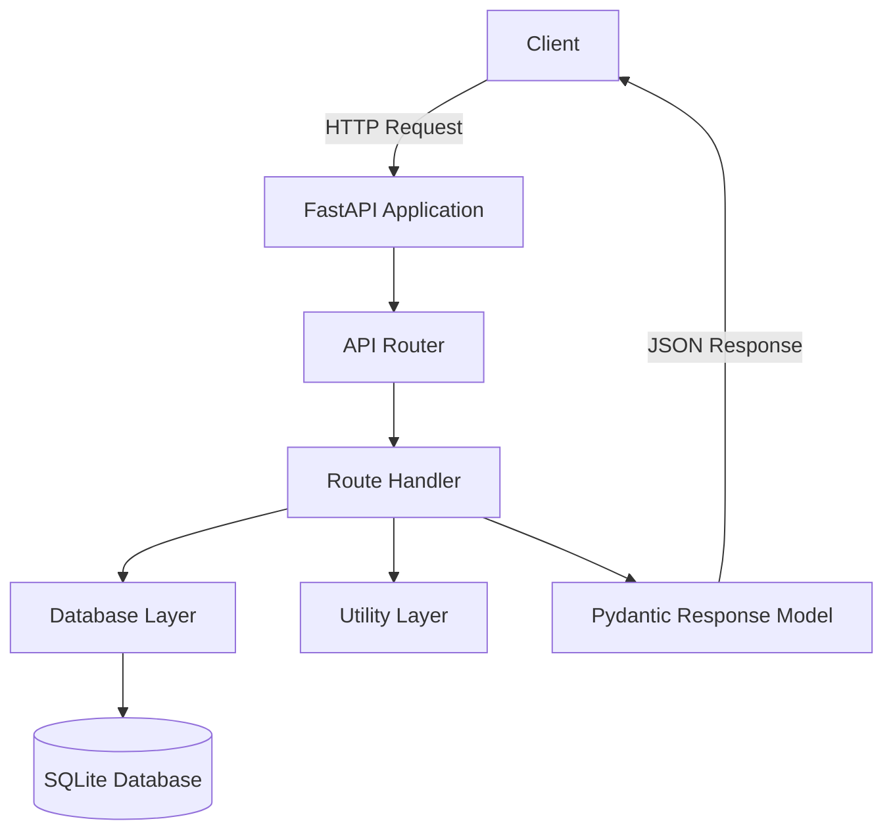
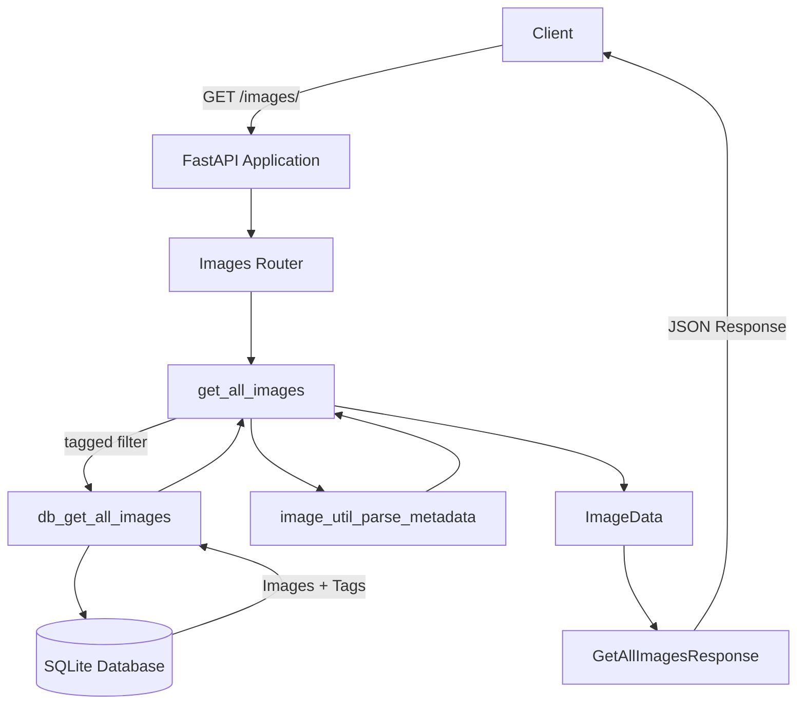

<!-- This page is a Swagger UI embed, not prose. The mkdocs swagger-ui-tag plugin requires the <swagger-ui> HTML element; the wrapper div and script scope page-specific CSS. The page title comes from the MkDocs nav config, so no top-level heading is needed here. -->
<!-- markdownlint-disable MD033 MD041 MD010 -->
<!-- # API Reference -->
## Backend API Architecture

PictoPy's Python backend exposes its HTTP API through FastAPI. Requests are routed from the application entry point to the corresponding route module, which interacts with the database and utility layers before returning a Pydantic response model.

## Image Retrieval API Flow

The `GET /images/` endpoint provides a concrete example of the backend request/response flow. The request is routed to `get_all_images()`, which retrieves image records through `db_get_all_images()`. The database layer retrieves image and tag data from SQLite, while image metadata is parsed before the results are converted into the response model.

	<swagger-ui src="openapi.json"/>

<!-- Add a small script to mark the page so we can scope header/footer CSS only for this route -->

