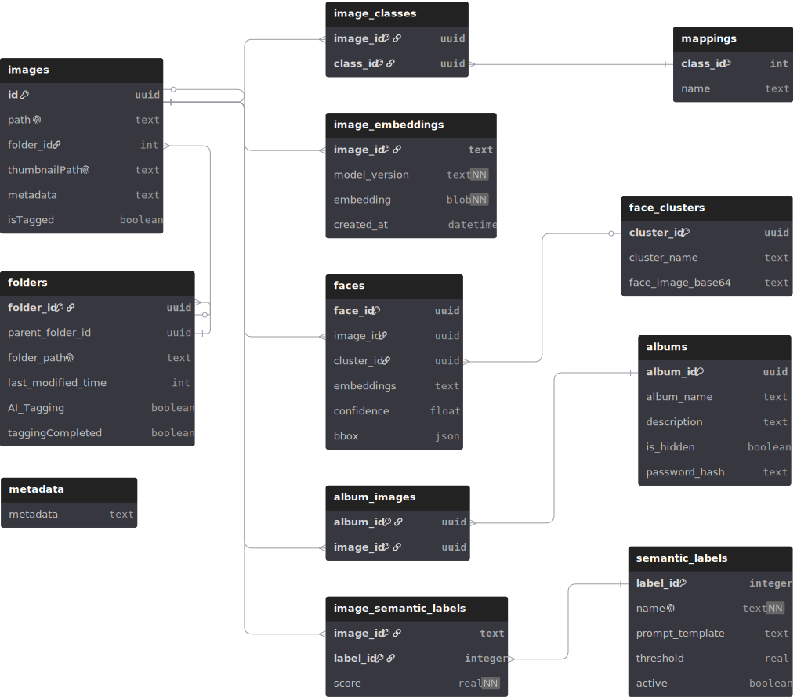

# Database

## Overview

PictoPy uses several SQLite databases to manage various aspects of the application. This document provides an overview of each database, its structure, and its primary operations.

## Database Schema

<!-- markdownlint-disable MD033 -->

  

<!-- markdownlint-enable MD033 -->

Alternatively, [click here to view the interactive DB schema diagram in a new tab](https://dbdiagram.io/d/PictoPy-685704c4f039ec6d364647e1).
