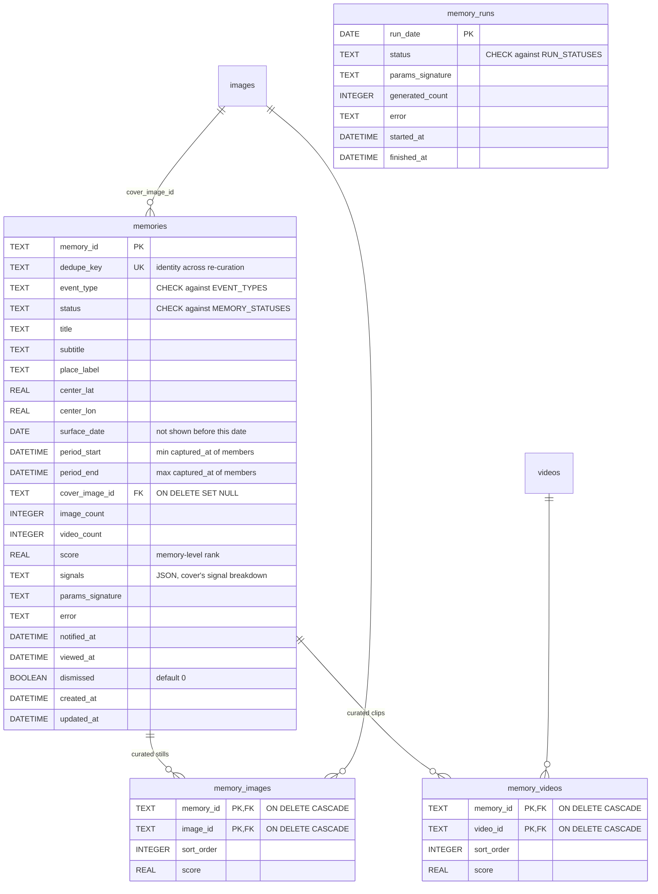
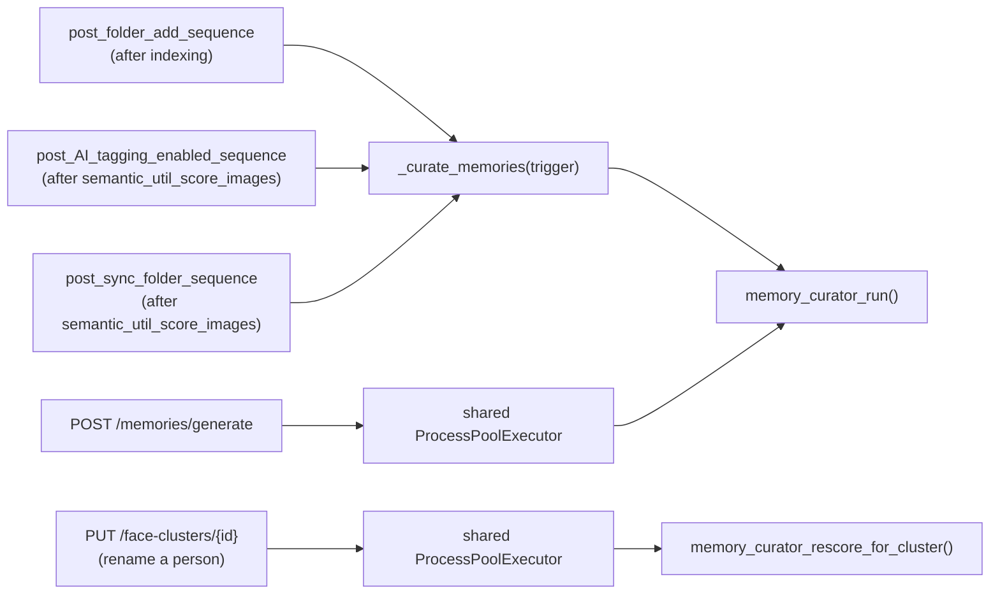

# Smart Memories

This page is the backend reference for Smart Memories: persisted, scored
collections of photos and short clips that PictoPy surfaces proactively
instead of waiting to be browsed. For the story viewer, the grid and the
settings screen that consume this data, see
[Frontend Memories](../../frontend/memories.md). Scoring and titling both lean
on the SigLIP2 embeddings and the curated label vocabulary described in
[Semantic Search](semantic-search.md).

## What a memory is

A **memory** is a database row plus an ordered set of images and videos drawn
from the library. It is produced by a **curation run**, which writes rows;
the UI only ever reads them back. Nothing is computed at request time.

Three triggers produce memories, and each run executes all three:

| Trigger (`event_type`) | Candidate set                                              |
| ---------------------- | ---------------------------------------------------------- |
| `anniversary`          | Photos captured on today's calendar date in previous years |
| `import_event`         | A burst of media that hangs together in time and place     |
| `semantic_event`       | Photos SigLIP2 recognizes as one occasion                  |

The backend files involved:

| Path                                      | Role                                                              |
| ----------------------------------------- | ----------------------------------------------------------------- |
| `backend/app/database/memories.py`        | Schema and every memories query helper                            |
| `backend/app/utils/memory_scoring.py`     | Per-item signals, normalization, dedupe, cohesion, time spreading |
| `backend/app/utils/memory_curator.py`     | The three triggers, run entry point, rescore entry points         |
| `backend/app/routes/memories.py`          | API router, mounted at `/memories`                                |
| `backend/app/schemas/memories.py`         | Pydantic request/response models                                  |
| `backend/app/schemas/user_preferences.py` | `MemoriesPreferences`, `MemoryScoringWeights`                     |

## Database schema

Four tables, all created by `db_create_memories_table()`
(`backend/app/database/memories.py`).



`memory_videos` is a second join table rather than a `media_type` column on
`memory_images`, because one id column cannot carry a foreign key to two
parents. **`sort_order` is a single sequence shared across both tables**, so a
story reads chronologically no matter how photos and clips interleave.
`interleave_by_time()` in `memory_scoring.py` numbers them.

`memory_runs` records one row per curation run. Producing zero memories on a
given day is a legitimate outcome, so "has today already run?" cannot be
answered from the `memories` table alone.

### Vocabularies

Three module constants define the allowed values, and the `CHECK` constraints
are built from those same tuples by `_check_in()` so the two cannot drift:

```python
EVENT_TYPES = ("anniversary", "import_event", "semantic_event")
MEMORY_STATUSES = ("pending", "complete", "failed", "empty")
RUN_STATUSES = ("running", "complete", "failed")
```

Curation writes `status = 'complete'`; `'pending'` is the column default and
`'empty'` is set by `db_prune_empty_memories()` when a memory's live image
count falls below `min_images`. The `Literal` types in
`backend/app/schemas/memories.py` mirror these three vocabularies.

### `dedupe_key`

`dedupe_key` is the stable identity of a memory across re-curation.
`db_upsert_memory()` resolves conflicts on it: the pre-existing `memory_id`
survives, and `viewed_at` / `notified_at` / `dismissed` are deliberately
excluded from the update column list, so rebuilding a memory never resets what
the user has already seen.

| Trigger          | Format                             | Example                         |
| ---------------- | ---------------------------------- | ------------------------------- |
| `anniversary`    | `anniv:{MM-DD}:{year}`             | `anniv:07-29:2021`              |
| `import_event`   | `import:{start_date}..{end_date}`  | `import:2026-07-11..2026-07-13` |
| `semantic_event` | `semantic:{class_id}:{start_date}` | `semantic:1184:2026-02-14`      |

### Indexes and creation order

Five indexes are created alongside the tables:

| Index                        | On                                                                                            |
| ---------------------------- | --------------------------------------------------------------------------------------------- |
| `ix_memories_surface_date`   | `memories(surface_date DESC)`                                                                 |
| `ix_memories_status_surface` | `memories(status, surface_date DESC)`                                                         |
| `ix_memories_surfaceable`    | Partial index over `(surface_date DESC, score DESC)` where unviewed, undismissed and complete |
| `ix_memory_images_image_id`  | `memory_images(image_id)`                                                                     |
| `ix_memory_videos_video_id`  | `memory_videos(video_id)`                                                                     |

`ix_memories_surfaceable` backs the "is there anything to show?" lookup; the
two `image_id`/`video_id` indexes exist so deleting a photo does not scan the
join tables.

`db_create_memories_table()` runs inside `lifespan()` in `backend/main.py`,
**after** `db_create_images_table()` and `db_create_videos_table()` — it
declares foreign keys into both. Databases created before `video_count`
existed get it through a guarded `ALTER`, since `CREATE TABLE IF NOT EXISTS`
is a no-op against an existing table.

### Query helpers

`backend/app/database/memories.py` is the only module that touches these
tables. The helpers worth knowing:

| Helper                                                                                             | Purpose                                                                               |
| -------------------------------------------------------------------------------------------------- | ------------------------------------------------------------------------------------- |
| `db_upsert_memory`                                                                                 | Write a memory and both join tables in one transaction                                |
| `db_get_memory` / `db_get_memory_images` / `db_get_memory_videos`                                  | Story payload, ordered by `sort_order`                                                |
| `db_list_memories`                                                                                 | Paginated cards plus a total count                                                    |
| `db_get_surfaceable_memory`                                                                        | The single best memory to surface now                                                 |
| `db_delete_stale_memories`                                                                         | Drop memories whose members' capture dates moved outside `period_start`..`period_end` |
| `db_prune_empty_memories`                                                                          | Mark memories that shrank below `min_images` as `'empty'`                             |
| `db_get_scoring_signals` / `db_get_video_scoring_signals`                                          | Every raw signal for a candidate set, in one pass                                     |
| `db_get_anniversary_candidates` / `db_get_recent_dated_images` / `db_get_images_in_period`         | The three candidate pools                                                             |
| `db_get_event_labels` / `db_get_event_label_hits` / `db_get_top_memory_label`                      | Semantic label reads                                                                  |
| `db_get_gps_histogram` / `db_get_gps_cell_centre`                                                  | Home-location detection                                                               |
| `db_start_memory_run` / `db_finish_memory_run` / `db_get_memory_run` / `db_reap_stale_memory_runs` | Run bookkeeping                                                                       |
| `db_is_indexing_busy`                                                                              | Whether any folder is mid-index or mid-tagging                                        |

`db_get_scoring_signals` uses correlated subqueries rather than joins across
`faces` / `album_images` / `image_classes`, and chunks its id list at
`SQLITE_ID_CHUNK`.

## Curation

### Entry point

```python
memory_curator_run(reference_date=None, force=False, trigger="manual") -> int
```

Returns the number of memories written. **It never raises** — its callers are
import hooks and background tasks where a curation failure must not fail the
surrounding work.

The run sequence:

```mermaid
sequenceDiagram
    participant Caller as API / folder hook
    participant Run as memory_curator_run()
    participant Runs as memory_runs
    participant Triggers as anniversary → semantic_event → import_event
    participant DB as memories tables

    Caller->>Run: reference_date, force, trigger
    Run->>Run: memory_curator_get_preferences()
    alt disabled and not force
        Run->>Runs: release any claimed run as 'failed'
        Run-->>Caller: 0
    end
    Run->>Runs: db_start_memory_run(run_date, params_signature)
    Run->>DB: db_delete_stale_memories() (guarded; failure is non-fatal)
    Run->>Run: build _CurationContext
    Note over Run: home location, active model_version,<br/>recently-used ids, library cohesion baseline
    loop each trigger, in order
        Run->>Triggers: curate(context)
        Note over Run,Triggers: each trigger is individually guarded —<br/>one failure does not cost the others their output
        Run->>Run: refresh recently_used so the next trigger<br/>cannot reuse what this one just claimed
    end
    Run->>Runs: db_finish_memory_run('complete', generated)
    Run-->>Caller: generated
```

`GENERATOR_VERSION = 2` is bumped when curation changes in a way that makes
existing memories stale. `memory_curator_params_signature()` hashes it
together with `min_images`, `max_images` and the weight set, and the resulting
16-character digest is stored on every memory as `params_signature`.

`_CurationContext` holds what every trigger shares within one run: the
reference date, preferences and weights, the detected home location, the
active SigLIP2 `model_version`, the recently-used image ids, and
`cohesion_baseline` — the mean pairwise cosine of a `COHESION_SAMPLE_SIZE`
(500) sample of the library's embeddings.

### The shared build path

All three triggers differ only in how candidates are found. `_build_memory()`
does everything after that, and returns whether the set qualified:

1. Optionally hard-exclude recently-used images (a memory's own photos, looked
   up by `dedupe_key`, are never excluded from itself).
2. Bail if fewer than `min_images` candidates remain.
3. `db_get_scoring_signals()` → `score_candidates()`, highest first. When
   recent use is a penalty rather than an exclusion, those ids are multiplied
   by `RECENT_USE_PENALTY` (0.35).
4. Fetch embeddings, then `suppress_near_duplicates()`.
5. `trim_incoherent()`, for triggers that opt into it.
6. `spread_over_time()` down to `max_images`.
7. Re-title from the surviving set, if the trigger supplied a `rename` hook.
8. Cover = the highest-scoring **still**; clips are never covers.
9. Select videos (see below), then `interleave_by_time()` to build the shared
   `sort_order`.
10. `db_upsert_memory()` with `status = 'complete'`.

Every one of steps 2, 3, 4 and 6 re-checks `min_images` and abandons the
memory if it no longer clears the bar.

### Trigger rules

|                  | `anniversary`                                                                               | `import_event`                                                      | `semantic_event`                                                 |
| ---------------- | ------------------------------------------------------------------------------------------- | ------------------------------------------------------------------- | ---------------------------------------------------------------- |
| Candidate pool   | `db_get_anniversary_candidates` over an `MM-DD` ±1 day window, years ≤ `reference.year - 1` | `db_get_recent_dated_images(5000)`                                  | `db_get_event_label_hits` over active `event` labels             |
| Grouping         | By capture year                                                                             | `segment_by_time_and_place`: split on a gap > 8 h or a jump > 40 km | `group_event_occurrences`: split each label's hits on a 36 h gap |
| Rejection        | Years with fewer than `min_images`                                                          | Segments spanning more than 14 days, or under `min_images`          | Fewer than 6 images, or cohesion below baseline + 0.15           |
| Ranking          | Most photos first, then most recent year                                                    | Most recent segment first                                           | Most images first                                                |
| Cap              | 2                                                                                           | 3                                                                   | 3                                                                |
| Recent use       | Penalized                                                                                   | Excluded                                                            | Excluded                                                         |
| Outlier trimming | No                                                                                          | Yes                                                                 | No                                                               |
| `surface_date`   | The reference date                                                                          | The run date                                                        | Upcoming anniversary within 3 days, else the run date            |

Notes on each:

- **Anniversary** — the ±1 day window absorbs timezone and EXIF drift, since
  an EXIF timestamp carries the camera's local time. The subtitle comes from
  the photos' own timestamps rather than being rebuilt from the reference
  date, because Feb 29 has no counterpart in a non-leap source year. Titles
  are `"1 year ago today"` / `"N years ago today"`. Outlier trimming is off:
  an anniversary spans years and is not supposed to look visually of a piece.
- **Import event** — segmentation is temporal, so two separate trips to the
  same place stay two memories. Before naming, `trim_incoherent()` drops
  photos that do not look like the rest of the segment.
- **Semantic event** — hits are selected by rank, not raw score (see
  [Scoring](#scoring) and the label-rank discussion in
  `db_get_event_label_hits`). Occurrences overlapping by ≥ 60% of the shorter
  span merge into one, with the primary label being whichever contributed more
  total confidence. Once an occurrence qualifies, `db_get_images_in_period()`
  pulls in the unlabeled photos captured between the recognized ones.

### Titling

| Trigger          | Title                                            | Subtitle                              |
| ---------------- | ------------------------------------------------ | ------------------------------------- |
| `anniversary`    | `"N years ago today"`                            | Month and year of the earliest member |
| `import_event`   | Top label if one qualifies, else a generic title | The formatted date span               |
| `semantic_event` | The occurrence's primary label                   | Month and year of the event start     |

`db_get_top_memory_label()` picks the label for an import event, and it runs
**after** trimming, on the final image set — a photo that was just dropped for
not belonging cannot vote on the name. It ranks by **summed percentile**,
which is count-dominant, and applies four gates: `EVENT_LABEL_TOP_N` (2) on
the per-image rank, `EVENT_LABEL_PERCENTILE` (0.50) on the within-label
percentile, `TITLE_MIN_IMAGES` (2), and `TITLE_MIN_SHARE` (0.15) of the
memory. The `event` and `scene` categories compete on equal terms;
`attribute` and `object` are never titles.

When no label qualifies, a stand-in from `GENERIC_TITLES_ONE_DAY` or
`GENERIC_TITLES_MANY_DAYS` is chosen by `sha256(dedupe_key)`, so a rebuild
never renames a memory the user has already been shown, and the date moves to
the subtitle. `EVENT_DISPLAY_NAMES` overrides labels whose title-cased form
reads wrong (`valentines day` → `Valentine's Day`, `bbq` → `BBQ`).

### Video selection

Clips are punctuation between stills, and only run when
`MemoriesPreferences.include_videos` is on.

```python
def video_quota(photo_count: int) -> int:
    if photo_count <= 0:
        return 0
    return min(MAX_VIDEOS_PER_MEMORY, max(1, round(photo_count / PHOTOS_PER_VIDEO)))
```

Candidates come from `db_get_video_candidates_in_period()`, bounded by the
span the selected photos already cover. A clip must have a **known** duration
in `0 < d <= MAX_VIDEO_SECONDS`; an unknown length is skipped rather than
gambled on. `select_videos_within_budget()` then takes the best-scoring clips
that fit `MAX_VIDEO_SECONDS_PER_MEMORY`, shortest winning a tie. The whole
video pass is wrapped in its own `try` — a story of photos is still a story.

### Key constants

All in `backend/app/utils/memory_curator.py`:

| Constant                               | Value        | Effect                                           |
| -------------------------------------- | ------------ | ------------------------------------------------ |
| `GENERATOR_VERSION`                    | `2`          | Feeds `params_signature`                         |
| `ANNIVERSARY_DAY_WINDOW`               | `1`          | ±1 day around today's `MM-DD`                    |
| `MAX_ANNIVERSARY_MEMORIES`             | `2`          | Anniversary memories per run                     |
| `IMPORT_GAP_HOURS`                     | `8.0`        | Gap that ends an import segment                  |
| `IMPORT_JUMP_KM`                       | `40.0`       | Distance jump that ends an import segment        |
| `IMPORT_MAX_SPAN_DAYS`                 | `14`         | Longest accepted import segment                  |
| `IMPORT_CANDIDATE_LIMIT`               | `5000`       | Import candidate pool cap                        |
| `MAX_IMPORT_MEMORIES`                  | `3`          | Import memories per run                          |
| `EVENT_GAP_HOURS`                      | `36.0`       | Gap that splits a label's hits into occurrences  |
| `EVENT_MIN_IMAGES`                     | `6`          | Minimum size of a semantic occurrence            |
| `EVENT_LABEL_TOP_N`                    | `2`          | Per-image rank a label must reach                |
| `EVENT_LABEL_PERCENTILE`               | `0.50`       | Within-label percentile a hit must reach         |
| `EVENT_COHESION_MARGIN`                | `0.15`       | Required margin over the library baseline        |
| `COHESION_SAMPLE_SIZE`                 | `500`        | Embeddings sampled to compute that baseline      |
| `EVENT_MERGE_OVERLAP`                  | `0.60`       | Overlap ratio that merges two occurrences        |
| `EVENT_ANNIVERSARY_LOOKAHEAD_DAYS`     | `3`          | How far ahead a semantic anniversary may be held |
| `MAX_SEMANTIC_MEMORIES`                | `3`          | Semantic memories per run                        |
| `TITLE_MIN_SHARE` / `TITLE_MIN_IMAGES` | `0.15` / `2` | Coverage a label needs to name a memory          |
| `PHOTOS_PER_VIDEO`                     | `9`          | One clip earned per nine photos                  |
| `MAX_VIDEOS_PER_MEMORY`                | `3`          | Clip cap                                         |
| `MAX_VIDEO_SECONDS`                    | `15.0`       | Longest single clip                              |
| `MAX_VIDEO_SECONDS_PER_MEMORY`         | `30.0`       | Total clip budget                                |
| `RECENT_USE_WINDOW_DAYS`               | `30`         | Window that counts as "recently used"            |
| `RECENT_USE_PENALTY`                   | `0.35`       | Multiplier applied when recent use is a penalty  |

## Scoring

`backend/app/utils/memory_scoring.py` scores one item at a time. Every signal
is normalized to 0–1, weighted, and summed.

### The seven signals

| Signal                | Source                                                                            | Default weight |
| --------------------- | --------------------------------------------------------------------------------- | -------------- |
| `favourite`           | `images.isFavourite`                                                              | 0.22           |
| `known_people`        | Distinct named `face_clusters` on the image, saturating at `MAX_NAMED_PEOPLE` (3) | 0.20           |
| `event_strength`      | `MAX(image_classes.score)` where the label's `category = 'event'`                 | 0.18           |
| `face_presence`       | Face count, saturating at `MAX_FACES` (4)                                         | 0.12           |
| `semantic_confidence` | `MAX(image_classes.score)` for `class_id >= SEMANTIC_CLASS_ID_OFFSET`             | 0.10           |
| `gps_novelty`         | `1 - exp(-d / 50 km)`, `d` = haversine distance to the detected home              | 0.10           |
| `in_album`            | `EXISTS(album_images)`                                                            | 0.08           |

Defaults live on `MemoryScoringWeights`
(`backend/app/schemas/user_preferences.py`) and are **normalized to sum to
1.0 on validation**, so a UI slider set never has to land on an exact total.
An all-zero set falls back to the defaults rather than dividing by zero.

Home is the densest rounded GPS cell (`HOME_CELL_PRECISION = 1`, roughly
11 km) with at least `MIN_IMAGES_FOR_HOME` (20) geotagged photos, resolved to
the mean coordinate of that cell. Below the floor, `detect_home_location()`
returns `None`, which disables `gps_novelty` entirely.

### Availability renormalization

`compute_signals()` returns both the values and the set of signals that
actually have data behind them, and `composite_score()` divides by the weight
of what was available:

```python
score = Σ(wᵢ · sᵢ) / Σ(wᵢ)   for i in available
```

A missing sensor reading is therefore not a demerit.

| Signal                                                   | Availability                                                                           |
| -------------------------------------------------------- | -------------------------------------------------------------------------------------- |
| `favourite`, `known_people`, `face_presence`, `in_album` | Always (`ALWAYS_AVAILABLE`) — a landscape genuinely has no faces                       |
| `semantic_confidence`, `event_strength`                  | Only once the image has a `scored_signature` — an unscored image is not a boring image |
| `gps_novelty`                                            | Only with both coordinates present **and** a detected home                             |

### Videos

`db_get_video_scoring_signals()` returns rows shaped like the image ones but
tagged `media_type = "video"`, which removes `UNAVAILABLE_FOR_VIDEO` —
`known_people`, `face_presence` and `in_album` — from the available set rather
than scoring them zero. It also sets `latitude`/`longitude` to `None`, so
`gps_novelty` is unavailable too. In practice a clip is ranked on
`favourite`, `event_strength` and `semantic_confidence`, read from
`video_classes` and from `video_frame_embeddings.scored_signature`.

### Near-duplicate suppression

`suppress_near_duplicates()` requires **both** conditions:

| Condition            | Constant             | Value           |
| -------------------- | -------------------- | --------------- |
| Cosine similarity ≥  | `DUP_COSINE`         | `0.90`          |
| Capture times within | `DUP_WINDOW_SECONDS` | `120.0` seconds |

Candidates must arrive best-first; the survivor of a duplicate pair is
whichever was already ranked higher. An item missing an embedding or a
timestamp cannot satisfy the pair test and is kept.

### Cohesion and trimming

`mean_pairwise_cohesion()` is the mean cosine between every pair in a group,
excluding the diagonal. It is preferred over cosine-to-centroid because it
does not drift with group size. `cohesion_baseline()` runs it over a random
sample of the library, and every cohesion test in the codebase is expressed as
a margin over that baseline rather than as an absolute cosine.

`trim_incoherent()` computes each item's leave-one-out cohesion to the rest,
then drops anything below:

```python
threshold = median - max(COHESION_MAD_SCALE * MAD_TO_STD * mad, COHESION_MIN_MARGIN)
```

with `COHESION_MAD_SCALE = 2.0`, `MAD_TO_STD = 1.4826` and
`COHESION_MIN_MARGIN = 0.10`. Median and MAD rather than mean and standard
deviation, and the trim is abandoned entirely if it would remove more than
`COHESION_MAX_TRIM_RATIO` (0.4) of the group, or if fewer than three
embeddings are available.

### Selection and ordering

- `spread_over_time()` buckets the event's span into `target` slices and takes
  the best candidate from each, backfilling by score where a bucket is empty.
  This is what stops ten frames from one minute of a three-day trip filling
  the whole story.
- `_chronological()` then orders the survivors for playback, breaking ties on
  score.
- `interleave_by_time()` merges photos and clips into the one shared
  `sort_order` sequence and returns the join-table rows for each.

### Memory-level score

`aggregate_memory_score()` produces the `memories.score` used to rank memories
against each other:

```python
base = mean(top 5 image scores)
size_boost = 1.0 + 0.15 * (log1p(n) / log1p(30))
diversity_boost = 1.0 + 0.10 * min(1.0, mean(class_count) / 10.0)
score = base * size_boost * diversity_boost
```

## API

Router: `backend/app/routes/memories.py`, mounted at `/memories` in
`backend/main.py`. Every endpoint declares a `response_model` and returns the
project's `{success, message, data}` envelope. Full request and response
schemas are in the live [API Reference](api.md).

| Method   | Path                    | Purpose                                                                                                                                        |
| -------- | ----------------------- | ---------------------------------------------------------------------------------------------------------------------------------------------- |
| `POST`   | `/memories/generate`    | Queue a curation run. Body: `{force, reference_date}`. Returns once queued, not once finished.                                                 |
| `GET`    | `/memories/status`      | `run_date`, `run_status`, `run_started_at`, `indexing_busy`, `unviewed_count`, `latest_memory_id`, `memories_enabled`, `notifications_enabled` |
| `GET`    | `/memories/today`       | The one memory to surface now                                                                                                                  |
| `GET`    | `/memories`             | Paginated cards. Query: `limit`, `offset`, `event_type`, `include_viewed`, `include_dismissed`                                                 |
| `GET`    | `/memories/{memory_id}` | Full story payload                                                                                                                             |
| `PATCH`  | `/memories/{memory_id}` | `{viewed, dismissed, notified}`                                                                                                                |
| `DELETE` | `/memories/{memory_id}` | Delete a memory; its photos remain                                                                                                             |

Behavior not obvious from the schemas:

| Condition                                                      | Response                                                                                                |
| -------------------------------------------------------------- | ------------------------------------------------------------------------------------------------------- |
| Nothing qualifies for `/today`                                 | `200` with `data.memory = null` — an empty library is a normal state for a polled endpoint, not a `404` |
| A run for that date is already `running`                       | `200`, `queued: false`, `status: "running"`                                                             |
| A run for that date is already `complete` and `force` is false | `200`, `queued: false`, `status: "complete"`                                                            |
| Memories are disabled and `force` is false                     | `200`, `queued: false` — no run is claimed                                                              |
| `reference_date` is not an ISO date                            | `400`                                                                                                   |
| `PATCH` body sets none of `viewed`/`dismissed`/`notified`      | `400`                                                                                                   |

`MemoryStory` carries `images` and `videos` as **two separate arrays**; the
viewer merges them on `sort_order`. Card and story rows both report a live
image count, recounted from `memory_images` rather than trusting the stored
`image_count`.

### Run claiming

`POST /generate` submits `memory_curator_run` to the app's shared
single-worker `ProcessPoolExecutor`, so curation serializes behind indexing
and semantic scoring instead of racing them. The route **claims the run**
(`db_start_memory_run`) before handing off, so a second caller arriving while
the executor is still starting sees `running` rather than queueing a duplicate
pass. Three paths release a claim nothing will finish:

| Path                                                       | Guard                                                             |
| ---------------------------------------------------------- | ----------------------------------------------------------------- |
| `executor.submit` itself raises                            | `_release_run()` in the route                                     |
| The worker process dies mid-curation                       | `_release_run_if_the_worker_died()`, via a `Future` done-callback |
| The curator declines the run because memories are disabled | `_release_claimed_run()` in `memory_curator.py`                   |

A release records the run as `failed`, not `complete`, so the next attempt is
free to run. Anything still `running` past `STALE_RUN_MINUTES` (30) is reaped
by `db_reap_stale_memory_runs()`, which both `/generate` and `/status` call
before reading the run row.

## Pipeline integration

Curation is not on a timer inside the backend. It runs from the points where
the library has just changed.



`_curate_memories(trigger)` lives in `backend/app/routes/folders.py`. It
imports the curator late, to keep it out of the module import graph, and
swallows failures so a curation problem never fails an import. It never passes
`force`: a background import is not the user asking for memories.

| Hook                               | Position                                                    | Trigger name  |
| ---------------------------------- | ----------------------------------------------------------- | ------------- |
| `post_folder_add_sequence`         | After indexing completes                                    | `folder_add`  |
| `post_AI_tagging_enabled_sequence` | After `semantic_util_score_images()`, before the video pass | `ai_tagging`  |
| `post_sync_folder_sequence`        | After `semantic_util_score_images()`, before the video pass | `sync_folder` |

The two AI hooks run before the video pass because semantic labels are written
by that point and the video pass can run for minutes. At `folder_add` no AI
has run yet, so only the date-driven triggers can produce anything; semantic
events appear once tagging is enabled and curation runs again.

`lifespan()` in `backend/main.py` creates the tables but **does not curate**.

### Rescore on rename

Renaming a face cluster changes the `known_people` signal for photos that are
already curated. `PUT /face-clusters/{cluster_id}` queues
`memory_curator_rescore_for_cluster` on the shared executor (failures
swallowed — renaming a person must succeed either way), which resolves the
affected memories through `db_get_memory_ids_for_cluster()` and calls
`memory_curator_rescore()`.

The rescore is deliberately **in place**: `db_update_memory_scores()` rewrites
each image's score, the cover, and the memory's own score. Membership and
`sort_order` are untouched, so a memory the user may already have watched is
never reshuffled.

## User preferences

`MemoriesPreferences` sits under `user_preferences.memories` and is served by
`GET` / `PUT /user-preferences/`. `MemoriesPreferencesUpdate` and
`MemoryScoringWeightsUpdate` are the partial-update models — every field is
optional.

| Field                    | Type                   | Default                  | Bounds       |
| ------------------------ | ---------------------- | ------------------------ | ------------ |
| `enabled`                | `bool`                 | `True`                   | —            |
| `notifications_enabled`  | `bool`                 | `True`                   | —            |
| `story_music_enabled`    | `bool`                 | `False`                  | —            |
| `slide_duration_seconds` | `float`                | `5.0`                    | 1.0–30.0     |
| `include_videos`         | `bool`                 | `True`                   | —            |
| `min_images`             | `int`                  | `5`                      | 2–50         |
| `max_images`             | `int`                  | `30`                     | 5–100        |
| `weights`                | `MemoryScoringWeights` | The seven defaults above | Each 0.0–1.0 |

A model validator rejects a set where `max_images < min_images`. A video slide
runs for its own length rather than `slide_duration_seconds`.

The curator reads preferences through `memory_curator_get_preferences()`,
which is **read-only by design**: `db_update_metadata` rewrites the whole
metadata blob, so a write from the curator process would clobber a concurrent
settings save. Invalid stored preferences log a warning and fall back to
defaults rather than failing the run.

`MemoryScoringWeightsUpdate` deliberately does **not** normalize — rescaling a
single slider to 1.0 would wipe out the others. Stored values stay raw, and
`resolve_weights()` normalizes them on read.
