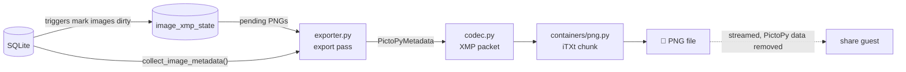

# Metadata Export Internals

PictoPy can write what it has derived about a photo — tags, faces, embeddings, favourites, albums — into the photo file as XMP, so the data survives a reinstall or a move. This page is for contributors: the data model, the XMP and PNG encoding, the dirty tracking that decides what to write, and how the sharing path keeps this data from leaving the machine.

What the feature means for users is described in [Metadata Export](../../overview/metadata-export.md). Only writing is implemented; nothing reads the exported metadata back during import yet.

## Data flow



## Where the code lives

| Module | Job |
| --- | --- |
| `app/utils/xmp/schema.py` | `PictoPyMetadata` and its parts; `SCHEMA_VERSION` |
| `app/database/image_export.py` | `db_get_image_export_data()`: everything to export for a batch of images |
| `app/utils/xmp/collector.py` | Turns those rows into `PictoPyMetadata` |
| `app/utils/xmp/codec.py` | `PictoPyXmpCodec`: metadata ↔ XMP packet, digest, stripping |
| `app/utils/xmp/containers/` | Where an XMP packet lives in a file format; only `png.py` exists |
| `app/utils/xmp/service.py` | `write_image_metadata`, `read_image_metadata`, `open_without_pictopy` |
| `app/database/xmp_export_state.py` | The `image_xmp_state` table, its triggers and accessors |
| `app/utils/xmp/exporter.py` | The export pass |
| `app/utils/xmp/debounce.py` | `ExportDebouncer`, which folds bursts of edits into one pass |
| `app/routes/metadata_export.py` | `POST /metadata-export/run`, `GET /metadata-export/status` |

The format code (codec and containers) knows nothing about the database, and the database code knows nothing about XMP. Supporting another file format means adding a container; changing how a field is stored means changing one codec section.

## What is exported

`db_get_image_export_data(image_ids)` reads each batch over one connection, in chunks of `SQLITE_ID_CHUNK` ids, and `collect_image_metadata()` maps it onto `PictoPyMetadata`:

| Field | Source | Notes |
| --- | --- | --- |
| `tags` | `image_classes` with `class_id < 1000`, joined to `mappings.name` | YOLO tags |
| `semantic_tags` | `image_classes` with `class_id >= 1000`, with `score` | Only labels still `active` in `semantic_labels` |
| `faces` | `faces` with `image_id` set, joined to `face_clusters.cluster_name` | Embedding, bbox, confidence, name. Video keyframe faces are excluded; unnamed clusters export no name |
| `image_embedding` | `image_embeddings.embedding` and `model_version` | |
| `favourite` | `images.isFavourite` | |
| `albums` | `album_images` joined to `albums` | **Locked albums are excluded** |
| `models` | constants and `image_embeddings.scored_signature` | `face_embedding` (when there are faces) and `semantic_vocabulary` |
| `width`, `height` | `images.metadata` JSON | Lets a reader detect a crop or resize |

## The XMP packet

PictoPy's data lives in its own `rdf:Description` in a standard XMP packet, under the namespace `https://pictopy.app/ns/1.0/` (prefix `pictopy`):

```xml
<x:xmpmeta xmlns:x="adobe:ns:meta/">
  <rdf:RDF xmlns:rdf="http://www.w3.org/1999/02/22-rdf-syntax-ns#">
    <!-- other tools' descriptions are kept as they were -->
    <rdf:Description rdf:about="" xmlns:pictopy="https://pictopy.app/ns/1.0/">
      <pictopy:SchemaVersion>1</pictopy:SchemaVersion>
      <pictopy:Tags><rdf:Bag><rdf:li>person</rdf:li></rdf:Bag></pictopy:Tags>
      <pictopy:Faces><rdf:Seq><rdf:li><rdf:Description>
        <pictopy:Embedding>…base64 float32…</pictopy:Embedding>
        <pictopy:BBox>{"height": 90, "width": 80, "x": 10, "y": 20}</pictopy:BBox>
        <pictopy:Confidence>0.97</pictopy:Confidence>
        <pictopy:ClusterName>Ann</pictopy:ClusterName>
      </rdf:Description></rdf:li></rdf:Seq></pictopy:Faces>
      <pictopy:Favourite>true</pictopy:Favourite>
      <pictopy:Width>612</pictopy:Width>
      <pictopy:Height>464</pictopy:Height>
      <pictopy:Digest>…sha256…</pictopy:Digest>
    </rdf:Description>
  </rdf:RDF>
</x:xmpmeta>
```

Each field is a **section**, an encode/decode pair listed in `SECTIONS` in `codec.py`:

| Section | Property | Encoding |
| --- | --- | --- |
| `tags` | `Tags` | `rdf:Bag` of names |
| `semantic_tags` | `SemanticTags` | `rdf:Bag` of `Name` + `Score` structs |
| `faces` | `Faces` | `rdf:Seq` of `Embedding`, `BBox`, `Confidence`, `ClusterName` structs |
| `image_embedding` | `ImageEmbedding` | `ModelVersion` + `Vector` struct |
| `favourite` | `Favourite` | `true` / `false` |
| `albums` | `Albums` | `rdf:Bag` of names |
| `models` | `Models` | `rdf:Bag` of `Role` + `Version` structs |
| `dimensions` | `Width`, `Height` | integers |

Vectors are little-endian float32, base64-encoded. `BBox` is JSON with sorted keys. Floats are written with `repr`, so they read back exactly. Empty lists and missing values are omitted; `Favourite` is always written.

Decoding is tolerant. A section that fails to decode is logged and skipped without losing the others, and simple properties are also read in attribute form (`pictopy:Favourite="true"`), which tools like exiftool write.

### Digest

`_build()` serializes PictoPy's description, hashes it with SHA-256, and only then appends `pictopy:Digest`. The digest covers the encoded form, so float32 rounding is identical on both sides of a comparison and vectors never need decoding to compare. `metadata_digest()` exposes it to the export pass.

### Versioning

`SCHEMA_VERSION` (currently `1`) is written as `pictopy:SchemaVersion`.

- `decode()` returns nothing for a packet from a newer schema, rather than guessing at its encoding.
- `encode()` raises `NewerSchemaError` instead of overwriting a newer packet, which `write_image_metadata` reports as `NEWER_SCHEMA`.
- Bump the version when a section's encoding changes incompatibly. Adding a section does not need a bump: older readers ignore properties they do not know.

!!! note "Rolling out a codec change"
    Automatic export only looks at images marked dirty, so a release that changes what the codec writes (a new section, a changed encoding) does not touch files exported before it. The **Export metadata** button does: it recomputes every PNG, and the new digest differs from the recorded one. To roll a change out without the user pressing the button, ship a migration that marks images dirty (`UPDATE image_xmp_state SET change_count = change_count + 1`).

### Living alongside other tools' metadata

- **Writing:** `encode()` parses the file's existing packet and removes every `pictopy:` element and attribute **at any depth**, because another tool may have merged PictoPy's properties into its own description or nested them in its structures. Every other property is kept. A bare `rdf:RDF` root is wrapped in `x:xmpmeta`.
- **Unreadable existing XMP:** a packet that cannot be parsed raises `UnreadableXmpError`, and nothing is written (`UNREADABLE_EXISTING`). Rewriting it would destroy another tool's data.
- **Untrusted input:** packets come from files PictoPy did not necessarily write. Packets declaring a DTD or entities are refused, and anything over 64 MB (`MAX_PACKET_BYTES`) is rejected before parsing.
- **Fidelity:** packets are re-serialized with ElementTree. The meaning is preserved, but comments, padding and the prefixes of namespaces ElementTree does not know (written as `ns0`, …) can change.

## The PNG container

`PngContainer` keeps the packet in an uncompressed `iTXt` chunk with the reserved keyword `XML:com.adobe.xmp`, placed before the first `IDAT`.

**Writing** (`write_xmp`):

1. Read the file and its stat.
2. Drop every existing XMP chunk, insert the new one before `IDAT`, and copy every other chunk byte-for-byte. Bytes after `IEND` are kept.
3. Write a temporary file in the same directory, `fsync` it and copy the permissions.
4. Refuse with `FileChangedError` if the file's size or nanosecond mtime changed since step 1.
5. `os.replace` it over the original, then restore the original access and modification times with `os.utime`.

Pixel data is never decoded or re-encoded, and a crash can never leave a half-written file. Because the file is replaced, its creation time on Windows is new; nothing in PictoPy reads creation time.

**Reading** (`read_xmp`) walks chunk headers and seeks past bodies, so a large PNG's pixel data is never read. Compressed `iTXt` is supported, with decompression capped at 64 MB.

`read_xmp` is deliberately strict, because `write_xmp` replaces every XMP chunk. It raises `PngFormatError` for more than one XMP chunk, a malformed or corrupt chunk, or one too large to read. A caller must not write over packets it could not see, so the export pass records these files as `UNREADABLE_EXISTING`.

`write_xmp` refuses a file containing a chunk larger than 256 MB (`MAX_CHUNK_BYTES`), treating it as corruption.

To support another format, implement the `MetadataContainer` protocol in `containers/base.py` (`supports`, `read_xmp`, `write_xmp`, `stream_with_xmp`) and register it in `containers/__init__.py`. `get_container()` picks a container by sniffing the file's first bytes, not its extension.

## Write outcomes

`write_image_metadata(path, metadata)` returns a `WriteOutcome`:

| Outcome | Meaning | File touched |
| --- | --- | --- |
| `WRITTEN` | Packet written | yes |
| `UNCHANGED` | The file's stored digest already matches | no |
| `UNSUPPORTED` | No container for this format | no |
| `NEWER_SCHEMA` | A newer PictoPy wrote this file | no |
| `UNREADABLE_EXISTING` | Existing XMP could not be read | no |

XMP that cannot be read becomes `UNREADABLE_EXISTING` rather than an error. Problems with the file itself are raised: `OSError` (including `FileChangedError`), and `PngFormatError` for a structurally broken PNG. The export pass records these as failures.

## Dirty tracking

`image_xmp_state` holds one row per image (`ON DELETE CASCADE` from `images`):

| Column | Meaning |
| --- | --- |
| `change_count` | Bumped by triggers on every write that can change the export |
| `exported_count` | The `change_count` the last successful export covered; `NULL` = never exported |
| `digest`, `file_size`, `file_mtime_ns` | What was written, and the file's stat afterwards |
| `last_outcome`, `last_error`, `failure_count`, `last_attempt_at` | The last attempt |

An image is **pending** while `exported_count IS NULL OR change_count > exported_count`. A partial index covers exactly those rows.

### Triggers

`db_create_image_xmp_state_table()` creates the table, backfills a row for every existing image, then drops and recreates its 18 triggers, so their definitions follow releases. It runs in `main.py` (and `tests/conftest.py`) after every table the triggers watch.

| Table | Fires on | Marks |
| --- | --- | --- |
| `images` | insert | creates the image's state row |
| `images` | `isFavourite` changed | that image |
| `images` | `metadata` width or height changed | that image |
| `image_classes` | insert, delete, change of `image_id`, `class_id` or `score` | that image |
| `mappings` | `name` changed | every image with that class |
| `semantic_labels` | `active` changed | every image with that label |
| `faces` (photo faces only) | insert, delete, change of `image_id`, `embeddings`, `bbox`, `confidence` or `cluster_id` | that image |
| `face_clusters` | `cluster_name` changed | every image with a face in the cluster |
| `image_embeddings` | insert, delete, change of `model_version`, `embedding` or `scored_signature` | that image |
| `album_images` | insert, delete | that image |
| `albums` | `album_name` or `is_locked` changed | every image in the album |

Rules the trigger set follows, each covered by a test in `tests/test_xmp_export_state.py`:

- **Column triggers check for a real change** (`WHEN OLD.x IS NOT NEW.x`). SQLite fires `UPDATE OF` even when a value is rewritten unchanged, and upserts take the update path.
- **Trigger bodies only `UPDATE` state rows, never insert.** A trigger fired during an image's cascade delete would otherwise violate the state row's foreign key.
- **Foreign-key actions fire child triggers.** Deleting a cluster (`ON DELETE SET NULL` on `faces.cluster_id`) or an album (`ON DELETE CASCADE` on `album_images`) needs no extra trigger.
- **The dimension check is wrapped in `json_valid`.** `json_extract` raises on malformed JSON, which would otherwise fail that image's rescan.

`db_create_YOLO_classes_table()` upserts mapping names only when they differ, rather than using `INSERT OR REPLACE`. A replace deletes the row first, which cascades to every `image_classes` row once foreign keys are on, and a startup refresh would mark every tagged image dirty.

The sync microservice shares the database but only reads `folders`, so these triggers never fire in its process.

If you add a write path to a table above, it is covered automatically. If you export a new field from a table the triggers do not watch, add a trigger and a test for it.

### The change-counter protocol

The export pass reads each candidate's `change_count`, collects its data, writes the file, and records success with `exported_count` set to **the count it started from**. An edit made while the file was being written raises `change_count` past that value, so the image stays pending and is written again by the next pass. A failure never touches `exported_count`, so a failed image stays pending.

## The export pass

`xmp_export_run(include_clean=False)` works through pending PNG images, chosen by a `.png` path extension in any case, in batches of 200 (`EXPORT_BATCH_SIZE`). For each image:

1. **Digest and stat both match** what was recorded → `UNCHANGED`. The file is not opened.
2. **Never written, and there is nothing to store** (no tags, faces, embedding, albums, or favourite) → recorded as `empty` and counted as `skipped`. The file is not opened.
3. **Otherwise**, the file is opened first, so an unreachable file (an unplugged drive, missing permission) fails and is retried instead of being reported as unsupported. Then `write_image_metadata` runs:
    - **`WRITTEN`:** the state row records the digest and new stat, and `images.metadata` gets the new `file_size` (`db_refresh_image_file_stat`). The folder rescan compares size and mtime, so without this every exported photo would be treated as edited.
    - **`UNCHANGED`:** recorded the same way.
    - **`UNSUPPORTED`:** counted as `skipped`. **`NEWER_SCHEMA`, `UNREADABLE_EXISTING`:** counted as `left_alone`. All three are recorded as done, with no digest, so automatic export does not retry them until the image changes again. The next manual export rechecks them.
4. **Any exception** is recorded with `db_record_xmp_export_failure` and the pass moves on. The warning is logged on an image's first failure only; repeats go to debug.

`include_clean=True` is the manual export. It recomputes every PNG instead of only the pending ones, and each image then goes through the same steps:

- **Already up to date** (digest and stat both match): nothing happens, and the file is not opened. This keeps the button idempotent.
- **Codec or schema changed** (the digest differs): the file is updated.
- **Another tool rewrote the file** (the stat differs): it is rechecked and repaired.

The cost is database reads and hashing for every PNG, not file access.

Writing a file inside a watched folder makes the sync microservice request a folder sync. That sync's rescan skips the file, because its stored size was refreshed, and its own export pass finds nothing pending, so exports never loop.

## When the pass runs

Every pass runs on `app.state.executor`, the single-worker process pool the processing pipeline uses, so two passes, or a pass and the pipeline, never write at the same time.

| Trigger | Where | Runs while the toggle is off |
| --- | --- | --- |
| End of the photo stages, before videos | `_export_metadata()` in `post_AI_tagging_enabled_sequence` and `post_sync_folder_sequence` (`routes/folders.py`) | no |
| Backend startup | `main.py` lifespan | no |
| Semantic model install | `submit_embedding_backfill_if_semantic()` in `routes/models.py` | no |
| User edits, debounced | `request_metadata_export()` in `routes/dependencies.py` | no |
| Settings → **Export metadata** | `POST /metadata-export/run` | **yes** |

The automatic paths call `xmp_export_if_enabled()`, which reads the `Metadata_Export` user preference (default `false`) in the worker process. In the pipeline, `_export_metadata()` swallows every exception, so exporting can never fail the processing before it.

### Debounced edits

These routes call `request_metadata_export(app_state)` after their database write succeeds:

- `POST /images/toggle-favourite`
- `POST /albums/from-memory`, `PUT /albums/{album_id}`, `DELETE /albums/{album_id}`
- `POST /albums/{album_id}/images`, `DELETE /albums/{album_id}/images/{image_id}`, `DELETE /albums/{album_id}/images`
- `PUT /face-clusters/{cluster_id}`, `POST /face-clusters/global-recluster`
- `PUT /user-preferences/`, only when it turns `Metadata_Export` on, to catch the library up

`request_metadata_export` never raises: the edit already stands. `ExportDebouncer` submits one pass `EXPORT_DEBOUNCE_SECONDS` (5 s) after the last edit; each new edit restarts the countdown. If the previously submitted pass is still queued, no new one is submitted, since the queued pass will see the new edits. If it is already running, a new one is submitted, since the running pass may be past the edited image. The lifespan closes the debouncer on shutdown.

The routes only nudge the debouncer; which images get written is decided by the triggers, so a route that changes nothing exported (an album description edit) costs one pass that finds nothing pending.

## API

`POST /metadata-export/run` starts a library-wide export (`include_clean=True`) unless one is already running, and returns the status. `GET /metadata-export/status` returns:

| Field | Meaning |
| --- | --- |
| `total` | PNG images in the library |
| `pending` | PNG images whose export is pending |
| `failed` | Pending images whose last attempt raised; they are retried |
| `left_alone` | Images not written on purpose: `unreadable_existing` or `newer_schema` |
| `running`, `run_failed` | State of the run started from Settings; automatic passes are not tracked |
| `last_run` | Summary of that run: `checked`, `written`, `unchanged`, `skipped`, `left_alone`, `failed` |

`left_alone` means the same in both places. `skipped` exists only in `last_run`: images with nothing to write, either no PictoPy data to store (recorded as `empty`) or an unsupported format.

The Settings card (`MetadataExportCard`) polls the status every 2 s while a run is going, and every 10 s while automatic export is on and images are pending.

## Sharing

PNGs served through an album share never carry PictoPy's metadata. The share route streams them through `open_without_pictopy()`, which removes only PictoPy's properties and leaves the original file untouched. How that works, and the caching rules for shared media, are in [Album Sharing](album-sharing.md#what-a-shared-photo-contains).

## Tests

All of these run against an isolated database: `tests/conftest.py` pins `DATABASE_PATH` to `test_db.sqlite3` and refuses to run against anything else.

```bash
cd backend && pytest tests/test_xmp_metadata.py tests/test_xmp_stripping.py tests/test_image_export.py tests/test_xmp_export_state.py tests/test_xmp_exporter.py tests/test_xmp_debounce.py tests/test_metadata_export_routes.py tests/test_metadata_export_pipeline.py
```

| File | Covers |
| --- | --- |
| `test_xmp_metadata.py` | Codec round trips, digest, versioning, PNG read/write, pixel identity, kept mtime |
| `test_xmp_stripping.py` | Realistic PNGs with EXIF, ICC, text and Lightroom-style XMP; nested and malformed packets; export never destroying unreadable XMP |
| `test_image_export.py` | What is collected, locked albums, inactive labels |
| `test_xmp_export_state.py` | Every trigger through the real `db_` write path, false marks, migration, the change-counter protocol |
| `test_xmp_exporter.py` | The pass on real files: skips, rewrites, failures and retries, manual run, the toggle |
| `test_xmp_debounce.py` | Coalescing, restart, running vs queued passes |
| `test_metadata_export_routes.py` | The two endpoints, and that each edit route schedules a pass |
| `test_metadata_export_pipeline.py` | Placement in both pipeline sequences, failure isolation, startup wiring |

## Known limitations

- PNG only. JPEG would need a container that handles XMP's 64 KB segment limit (Extended XMP) for embeddings.
- Write-only: import does not read the metadata back yet.
- Face clusters are exported by name only; faces in unnamed clusters lose their grouping.
- The YOLO model variant that produced the tags is not recorded per image, so it is not exported.
- XMP stored in ImageMagick's legacy `Raw profile type xmp` text chunk is not recognized.
- Log lines at INFO level from the export pass do not appear in the backend console, because it runs in the process pool's worker. Warnings do appear.
