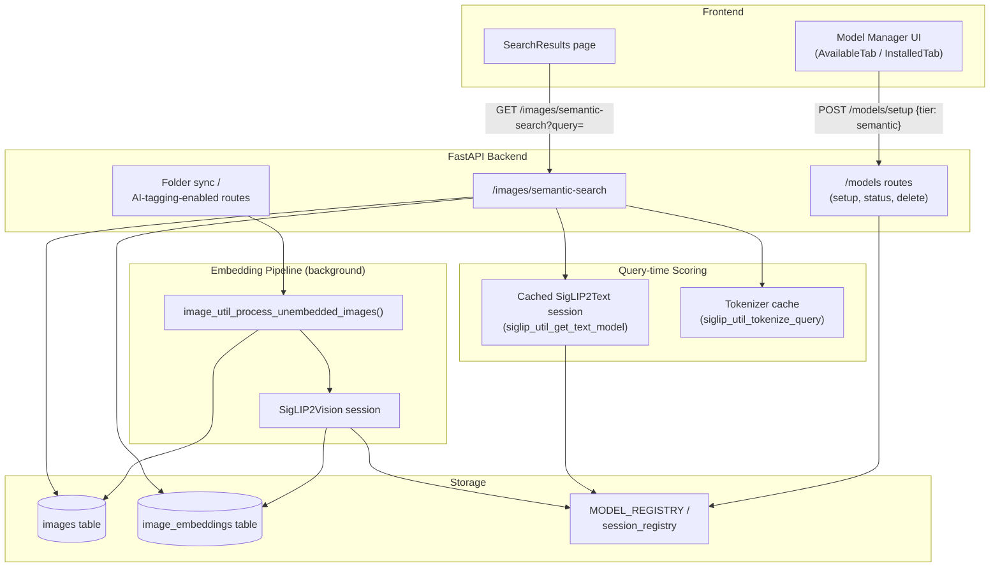
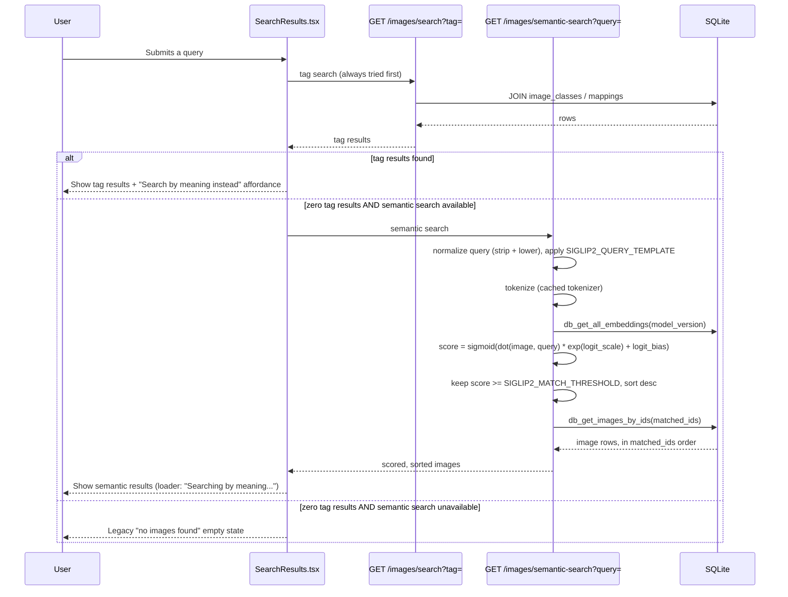
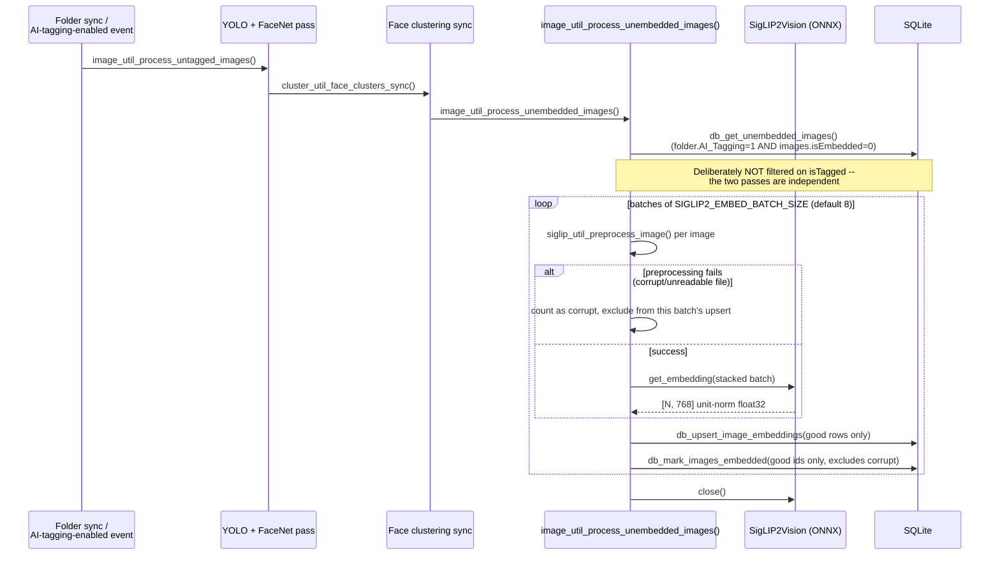
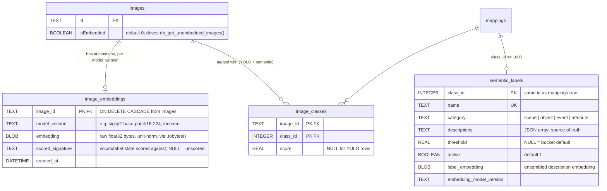

# Semantic Search (SigLIP2)

This page is a technical deep-dive into PictoPy's semantic (natural-language)
photo search feature, built on Google's [SigLIP2](https://huggingface.co/docs/transformers/en/model_doc/siglip2)
model family. For the friendlier introduction alongside YOLO/FaceNet, see
[Image Processing](image-processing.md#semantic-search-with-siglip2). This
page documents exact behavior as implemented, including the concurrency and
lifecycle bugs that were found and fixed while building it, since those are
the parts most likely to regress silently.

## What it does

A user types a free-text query ("beach sunset", "two people hugging") into
the same search box already used for tag search. No separate mode toggle
exists. Under the hood:

1. Every photo in an AI-tagging-enabled folder gets a 768-dimensional
   embedding vector computed once, in the background, alongside the existing
   YOLO/FaceNet tagging pass.
2. At query time, the query text is embedded live (this is cheap — a single
   text encode, not a re-scan of the library) and scored against every
   stored image embedding with a matrix multiply.
3. Results above a calibrated threshold are returned, sorted by score.

Because the query is embedded live, an arbitrary query the system has never
seen before works immediately — there is no fixed vocabulary to update or
re-index against.

## Architecture



## Search request flow

`/search?tag=` was **not** given a `mode=semantic` query param bolted on top.
Instead, the frontend tries exact tag search first and only falls back to
semantic search when nothing matches — this keeps the existing tag-search
path completely untouched and adds semantic search as a fallback, not a
replacement. Since the curated-vocabulary layer landed, tag search also
matches the ~395 precomputed semantic labels (see
[the vocabulary section](#curated-vocabulary-layer-semantic_labels)), so
common words like "beach" or "sunset" get instant cache hits and never
reach the live-scoring fallback.



Notes on this flow, confirmed against the actual implementation
(`backend/app/routes/images.py::semantic_search_images`, `frontend/src/pages/SearchResults/SearchResults.tsx`):

- **The frontend never re-sorts.** `matched_pairs.sort(key=lambda x: x[1], reverse=True)`
  is the *only* place sort order is established, inside the route handler.
  Everything downstream (`matched_ids`, the `db_get_images_by_ids` call, the
  final response) just follows that order through — the response is built by
  iterating `db_get_images_by_ids`'s return value directly, in whatever order
  it comes back. This only works because `db_get_images_by_ids` preserves its
  caller-supplied ID order internally; it is not a coincidence and must not
  be changed without also touching this endpoint.
- **Empty tag results vs. a tag-search error are handled differently.**
  A successful tag search with zero results triggers the semantic fallback.
  A tag-search *error* surfaces directly as an error — it does not fall back.
- **A 404 from `/semantic-search`** (text model or tokenizer file missing)
  is treated as "feature unavailable," not a generic error — the frontend
  detects it by HTTP status code (`error.response.status === 404`), not by
  matching on the error message text.
- **Scores are never shown to the user.** The empty state for a semantic
  search with zero matches reads "No matches found. Try describing the photo
  differently." — it does not expose the threshold or any numeric score.

## Embedding generation pipeline

Embeddings are generated in a background pass, sequentially **after** YOLO
tagging and face clustering finish for the same batch of photos — never
concurrently with them, and never gated on the tier tables the frontend uses
elsewhere in the app.



Two details here are easy to get wrong on a re-read of the code, so they're
called out explicitly:

- **Corrupt images are retried, not permanently excluded.** `db_mark_images_embedded`
  is called with only the IDs that produced an embedding (`good_ids`), not
  every ID in the batch. A corrupt/unreadable image stays `isEmbedded = False`
  and re-enters `db_get_unembedded_images()` on the next pass. This
  deliberately does **not** follow the YOLO/face pipeline's
  mark-processed-regardless-of-outcome convention: that convention exists to
  avoid re-running *expensive* inference on images that will never classify
  differently, but SigLIP2 preprocessing failure is a cheap check (PIL
  failing to open/decode), so the retry cost is low — and it means a file
  that becomes readable later (a transient lock, a restored backup) still
  eventually gets embedded instead of being silently excluded from semantic
  search forever.
- **The upsert happens before the mark.** If the process crashes between
  `db_upsert_image_embeddings` and `db_mark_images_embedded`, the image is
  re-embedded (harmless, idempotent) rather than silently lost with no
  embedding and no record of the gap.
- **Where it's wired in:** `post_AI_tagging_enabled_sequence()` and
  `post_sync_folder_sequence()` in `backend/app/routes/folders.py`, both
  calling it *last*, after YOLO/face clustering. Gating is inherent in the
  `AI_Tagging` join in the SQL query itself — non-AI-tagging folders never
  produce a single row from `db_get_unembedded_images()`, so no special-case
  code exists for "user has this feature off."
- **Existing libraries backfill automatically.** Every image row already has
  `isEmbedded = FALSE` by default (see the schema below), so pre-existing
  photos enter the same processing queue as newly added ones — no separate
  migration script is needed for this.

## Database schema



### `image_embeddings` — active, in use

```sql
CREATE TABLE IF NOT EXISTS image_embeddings (
    image_id TEXT PRIMARY KEY,
    model_version TEXT NOT NULL,
    embedding BLOB NOT NULL,
    created_at DATETIME DEFAULT CURRENT_TIMESTAMP,
    scored_signature TEXT,  -- added via guarded ALTER; see vocabulary layer
    FOREIGN KEY (image_id) REFERENCES images(id) ON DELETE CASCADE
);
CREATE INDEX IF NOT EXISTS ix_image_embeddings_model_version
    ON image_embeddings(model_version);
```

- **`embedding` is a `BLOB` of raw `float32` bytes** (`np.ascontiguousarray(embedding, dtype=np.float32).tobytes()`
  / read back with `np.frombuffer(blob, dtype=np.float32)`), not JSON-in-TEXT
  like the `faces` table's embeddings. This was a deliberate deviation,
  decided after investigating `sqlite-vec` as an alternative and finding it
  would require introducing SQLite extension-loading from scratch — no
  existing precedent in this codebase — plus real PyInstaller packaging work
  for the platform-specific extension binary. Brute-force `matrix @ query`
  was measured fast enough at realistic scale (200 images: full similarity
  computation in ~0.003s in the original PoC), so that packaging risk wasn't
  justified. An ANN index (or `sqlite-vec`) remains a valid future escalation
  if brute-force ever stops being fast enough — not foreclosed, just not
  needed yet.
- **`model_version` is required and indexed**, and every read
  (`db_get_all_embeddings`) filters by it. Swapping the active checkpoint
  (`base` → `large`, say) changes the vector space entirely; without this
  filter, old and new embeddings would silently mix in scoring. This project
  had no existing convention for model-versioning a stored artifact before
  this table — it's establishing one.
- **One row per `image_id`**, not per `(image_id, model_version)` — the
  primary key is `image_id` alone, so re-embedding under a different
  checkpoint overwrites (`ON CONFLICT(image_id) DO UPDATE`) rather than
  accumulating multiple rows per image. An image only ever has an embedding
  for whichever checkpoint last processed it.
- **Stored embeddings are unit-norm** (L2-normalized inside
  `SigLIP2Vision.get_embedding`, once, at generation time). Query-time
  scoring must never renormalize either side — both are unit-norm by
  contract, and renormalizing would silently double-apply the normalization
  math.

### Curated vocabulary layer (semantic_labels)

The curated-vocabulary layer scores every embedded image against ~395
predefined labels (scenes, objects, events, attributes) and stores the
results as **regular tags**: labels register as `mappings` rows at
`class_id >= 1000` (`SEMANTIC_CLASS_ID_OFFSET`; YOLO owns 0–79), and the
scoring pass writes plain `image_classes` rows with a `score`. Tag search,
tag chips, and person-view tag lists pick them up with no consumer changes.
The planned `image_semantic_labels` table was dropped in favor of this
reuse. Free-text search is unaffected — this layer is a cache/browse
feature, not a search gatekeeper.

`semantic_labels` itself is a definition + cache table:

```sql
CREATE TABLE IF NOT EXISTS semantic_labels (
    class_id INTEGER PRIMARY KEY,    -- same id as the mappings row
    name TEXT UNIQUE NOT NULL,
    category TEXT NOT NULL,          -- scene | object | event | attribute
    descriptions TEXT NOT NULL,      -- JSON array; source of truth
    threshold REAL,                  -- per-label override, NULL = bucket default
    active BOOLEAN DEFAULT 1,
    label_embedding BLOB,            -- renormalized mean of description embeddings
    embedding_model_version TEXT
);
```

Key behaviors (all in `backend/app/utils/semantic_labels.py` and
`backend/app/database/semantic_labels.py`):

- **Seed**: `backend/app/data/semantic_vocabulary.json` is idempotently
  upserted at startup. Description edits null the cached label embedding;
  labels removed from the seed deactivate; YOLO-name collisions are skipped.
- **Label embeddings**: each label's 2–4 caption-shaped descriptions are
  encoded through the text tower and averaged (prompt ensembling) — this is
  the fix for SigLIP2's bare-noun weakness on the curated path.
- **Scoring**: one matmul per image against the label matrix, bucket
  thresholds (`SEMANTIC_BUCKET_THRESHOLDS` — calibrated, ~2 orders of
  magnitude below `SIGLIP2_MATCH_THRESHOLD`, never interchangeable), top-15
  stored (`SEMANTIC_SCORE_TOP_K`).
- **Invalidation**: a scoring signature (checkpoint + vocab + thresholds +
  K + label-matrix bytes) is stamped per image in
  `image_embeddings.scored_signature`; any change re-scores wholesale.
- **Display cut**: the `image_classes_display` view (recreated each
  startup) caps chips at the top-5 semantic tags per image
  (`SEMANTIC_DISPLAY_TOP_K`); search matching uses the full table.
- Calibration data: `backend/scripts/vocabulary/calibration_report.json`.

!!! note "Schema migrations"
    This project has no migration tooling — `CREATE TABLE IF NOT EXISTS`
    is a no-op against an existing table. The vocabulary layer handled
    this two ways: the old `semantic_labels`/`image_semantic_labels`
    shells shipped with **no writers** (guaranteed empty), so they are
    detected via `PRAGMA table_info` and drop-recreated; the populated
    tables got **guarded ALTERs** (`image_classes.score`,
    `image_embeddings.scored_signature`) that check column presence
    before altering.

## Model distribution and checkpoints

SigLIP2 ships as three separate files per checkpoint — a vision-tower ONNX
graph, a text-tower ONNX graph, and a tokenizer JSON — following the same
`MODEL_REGISTRY` + GitHub Release + SHA-256 verification pattern already used
for YOLO/FaceNet, not a new distribution mechanism.

| Checkpoint | Status | Vision size | Text size | Tier |
| --- | --- | --- | --- | --- |
| `base` | **Shipped** (`models-v1.0` release) | 354.5 MB | 1077.1 MB | `semantic` |
| `large` | Placeholder (`PLACEHOLDER_URL`/`PLACEHOLDER_SHA256`) | — | — | `medium` |
| `so400m` | Placeholder (`PLACEHOLDER_URL`/`PLACEHOLDER_SHA256`) | — | — | `manual` |

Only `base` has real registry entries (URL, SHA-256, size). `large` and
`so400m` are deliberately kept **out of `TIER_MODELS`** with placeholder
values until a real export run backfills them — this is why `/models/status`
filters out any entry with a placeholder URL/SHA-256, so a user never sees
an uninstallable model in the Model Manager UI.

**Why two ONNX files per checkpoint, not one combined file:** measured, not
assumed. A combined file with two named outputs was built and directly
tested against the two-file approach — `session.run()` on a combined graph
runs the **full graph** regardless of which output is requested (a
text-only query against the combined session took as long as querying both
outputs, and used as much memory as loading both towers). Two files is also
the only option that matches the existing `YOLO.onnx`/`FaceNet.onnx`
pattern already in this codebase.

**Why `so400m` is manual-install-only, everywhere, forever:** the original
maintainer brief said "~1.5GB", and the `so400m` name misleadingly suggests
~400M params (that number describes only the vision tower, a naming
convention predating SigLIP2). The full dual-tower model is actually
1.136B params / 4.54GB — nowhere near "~1.5GB". `base` (1.5GB) is the
checkpoint that actually matches the original size target.
`detect_hardware_tier()` itself was not modified to accommodate this;
`so400m` is exposed purely as a manually-installable option, reusing the
override pattern the Model Manager already used for installing a YOLO tier
above a user's detected hardware.

### Scoring metadata

Each checkpoint has its own calibration constants in
`SIGLIP2_SCORING_METADATA` (`backend/app/config/settings.py`), derived
directly from the checkpoint (not tunable in the sense that changing them
would require re-deriving from the model, not just picking a new number):

| Checkpoint | `logit_scale` | `logit_bias` | `model_version` | `input_resolution` |
| --- | --- | --- | --- | --- |
| `base` | 4.724453449249268 | -16.771724700927734 | `siglip2-base-patch16-224` | 224 |
| `large` | 4.6823530197143555 | -16.347614288330078 | `siglip2-large-patch16-384` | 384 |
| `so400m` | 4.699519157409668 | -15.932647705078125 | `siglip2-so400m-patch14-384` | 384 |

Scoring formula (`backend/app/routes/images.py`):

```python
scaled_logits = dot_product * exp(logit_scale) + logit_bias
score = sigmoid(scaled_logits) = 1 / (1 + exp(-scaled_logits))
```

This is SigLIP2's own learned scale/bias (the sigmoid-loss calibration
baked into the model), applied to a **raw cosine similarity** (both vectors
are unit-norm, so the dot product *is* the cosine similarity) — not the
`pipeline()` API's opaque scoring, which was one of the first things ruled
out early in this feature's design because it hides reusable embeddings and
only exposes a top-1 label.

**Absolute scores run low even for real matches** — this is a documented
SigLIP2 community phenomenon (consistent with the sigmoid loss's negative
bias initialization), not a bug. Empirically, on a real production library:

| Score range | Meaning |
| --- | --- |
| 0.6 – 0.9 | Strong match (descriptive phrases hit this range easily) |
| 0.01 – 0.05 | Weak-but-real match (common for bare-noun queries on thumbnail-grade images) |
| < 0.005 | Noise |

`SIGLIP2_MATCH_THRESHOLD` defaults to `0.01` (moved down from an initially
measured `0.02`, which was empirically cutting true positives at that low
end).

## Settings reference

All in `backend/app/config/settings.py`, all environment-variable
overridable via the project's existing `_get_env_str`/`_get_env_int`/`_get_env_float`
helpers (which log a warning and fall back to the default on an invalid or
out-of-range value, rather than crashing):

| Setting | Default | Notes |
| --- | --- | --- |
| `SIGLIP2_ACTIVE_CHECKPOINT` | `"base"` | Falls back to `"base"` with a logged warning if set to anything not in `SIGLIP2_SCORING_METADATA`. |
| `SIGLIP2_QUERY_TEMPLATE` | `"This is a photo of {query}."` | Applied to every query before tokenizing — see [Preprocessing and calibration](#preprocessing-and-calibration-the-part-that-must-not-drift) below. |
| `SIGLIP2_EMBED_BATCH_SIZE` | `8` | Minimum enforced at `1`. Matches the batch size validated during the original PoC benchmarking. |
| `SIGLIP2_TEXT_MAX_LENGTH` | `64` | Fixed at export time (the ONNX text graph's sequence dimension is a **fixed** 64, not dynamic) — changing this constant without re-exporting the model produces a shape-mismatch error, not silently wrong numbers. |
| `SIGLIP2_TOKENIZER_PAD_ID` / `SIGLIP2_TOKENIZER_PAD_TOKEN` | `0` / `"<pad>"` | Padding config passed to the `tokenizers` library. |
| `SIGLIP2_MATCH_THRESHOLD` | `0.01` | See the score-range table above. |

## Preprocessing and calibration (the part that must not drift)

`siglip_util_preprocess_image` (`backend/app/utils/SigLIP.py`) is the single
most calibration-sensitive piece of this feature, and it says so directly in
a code comment:

> Production is self-consistent: `SIGLIP2_MATCH_THRESHOLD` was tuned against
> **this** pipeline. Any future threshold/calibration work must use this
> function, not `AutoImageProcessor`.

Measured specifics, from real debugging of a production quality regression:

- **PIL, not OpenCV.** An earlier `cv2`-based preprocessing path was
  replaced with PIL bicubic resize. On small web-sized thumbnails the
  cosine similarity between the two was ~0.985–0.989 — small, but large
  enough to flip true positives across the 0.02 threshold that was in use at
  the time. On real, full-resolution camera photos (≈18× downscale factor),
  the gap widened to a **0.83–0.90** cosine similarity — a real accuracy
  collapse, because `cv2.INTER_CUBIC` does not antialias on downscale by
  default, while Pillow (≥9.1) does.
- **PIL vs. the real HF `SiglipImageProcessor`** still differ (~0.984 cosine
  similarity) — HF uses an internal resampler that plain `PIL.Image.resize`
  does not reproduce exactly. Shipping bit-exact HF parity would require
  bundling `transformers`, which was judged not worth it: production is
  internally consistent (images and queries share the same preprocessing
  path), and the threshold/scale/bias are all calibrated against *that*
  path, not against HF's.
- **Any preprocessing change invalidates existing embeddings.** After the
  `cv2` → PIL switch, every previously stored embedding was stale and had to
  be regenerated — see [`scripts/reset_embeddings.py`](#maintenance-scriptsreset_embeddingspy)
  below.
- **Query normalization matters as much as image preprocessing.** A query is
  `strip()`'d and `lower()`'d before templating. Skipping this caused two
  reproducible bugs during development: (1) `"Beach"` scored very
  differently from `"beach"` because the SentencePiece tokenizer is
  case-sensitive *and* a capitalized noun mid-template reads like a proper
  noun ("This is a photo of Beach." ≈ a place name); (2) un-templated raw
  queries land outside the calibration regime entirely, since every
  threshold/scale/bias number here was derived using the
  `"This is a photo of {query}."` template.

## ONNX session lifecycle and concurrency safety

`SigLIP2Vision` and `SigLIP2Text` (`backend/app/models/`) both extend a
shared `ONNXSessionBase` (`backend/app/models/ONNXSessionBase.py`), which
handles lazy session creation, `session_registry` registration, and
thread-safe close. This class only exists because the identical logic was
originally duplicated between the two model classes, and a subtle
concurrency bug was found and fixed once it was consolidated.

**Contract subclasses must follow:** `get_session()` must snapshot
`self._session` and any tensor-name attributes into **local variables**
*before* releasing `_lock`, then return those locals — never re-read
`self.*` after the lock is released. The bug this prevents: a concurrent
`close()` can null those attributes between an in-lock check and an
out-of-lock return, handing a caller a valid session object paired with a
`None` tensor name. This was caught by an 8-thread concurrent stress test
against the real ONNX models, hammering `get_embedding()`/`close()`
simultaneously.

**Registration-leak bug (fixed):** `close()`'s cleanup used to be gated on
`self._session is not None`. But `get_session()` can register a session
(via `mark_model_session_active`, incrementing `session_registry`'s active
count) and *then* null `self._session` on a tensor-name validation failure,
while `_session_registered` stays `True`. With the old gate, `close()` would
see `self._session is None` and skip the entire cleanup block — including
the `mark_model_session_inactive` call — leaking the registration forever
and permanently blocking that model from being uninstalled (`DELETE
/models/{key}` checks `session_registry`'s active count before allowing
deletion). Fixed by decoupling the registration release from the
session-null check. Covered by `backend/tests/test_onnx_session_base.py`,
including a test that reproduces the exact leak precondition.

### Text-session caching and the uninstall interaction

Per-request instantiate-then-close of `SigLIP2Text` was measured as the
dominant cost of a `/semantic-search` call (the text tower is ~1GB).
`siglip_util_get_text_model` (`backend/app/utils/SigLIP.py`) caches a
single `SigLIP2Text` instance across requests instead — safe because ONNX
Runtime sessions support concurrent `Run()` calls from multiple threads.

This introduces one real hazard: the cached instance registers itself with
`session_registry` on first use, and since it's never explicitly closed
between requests, its "active" count would never reach zero — permanently
blocking `DELETE /models/{key}` for the text model, since that endpoint
requires the active count to hit zero before proceeding.
`routes/models.py::delete_model` handles this directly: before checking the
active-session guard, it calls `siglip_util_invalidate_text_model(model_key)`
whenever the model being deleted has `feature == "semantic_text"`, which
closes the cached session first. The full cycle — cache, block-on-delete,
invalidate, delete-allowed, transparent recreation on next search — is
covered by `backend/tests/test_semantic_search_route.py` and was manually
verified end-to-end against the real ONNX models during development.

## API reference

`GET /images/semantic-search?query=<text>` — see the live
[API Reference](api.md) (Swagger UI) for the full request/response schema.
Summary of behavior not obvious from the schema alone:

| Condition | Response |
| --- | --- |
| Text model file missing | `404`, `message` mentions "text model not installed" |
| Tokenizer file missing | `404`, `message` mentions "tokenizer not installed" (checked independently of the text model) |
| Query is empty after `strip()` (e.g. whitespace-only) | `400` — note `min_length=1` on the FastAPI `Query` param only checks raw string length, so a whitespace-only string passes that check and is caught by this separate normalization step |
| No embeddings exist yet for the active checkpoint | `200`, empty result, friendly message ("No images have been embedded yet.") |
| Embeddings exist but none clear the threshold | `200`, empty result, message includes the threshold value used |
| Matches found | `200`, images sorted descending by score, each score rounded to 4 decimal places |

## Maintenance: `scripts/reset_embeddings.py`

```python
DELETE FROM image_embeddings;
UPDATE images SET isEmbedded = 0 WHERE isEmbedded = 1;
DELETE FROM image_classes WHERE class_id >= 1000;  -- semantic tag rows
```

Run this any time the embedding or preprocessing pipeline changes in a way
that invalidates already-stored embeddings (checkpoint swap, preprocessing
fix, threshold recalibration against a different pipeline). It forces every
image back through `image_util_process_unembedded_images()` on the next
sync/tagging pass; the semantic scoring sweep then re-tags them. There is no automatic detection of "preprocessing
changed, invalidate stored embeddings" — this script is a manual step a
developer runs deliberately.

## Test coverage

| File | Covers |
| --- | --- |
| `tests/test_image_embeddings.py` | `image_embeddings` table CRUD: round-trip storage/retrieval, `model_version` filtering, upsert-overwrites-existing-row, FK cascade delete. Runs against a disposable per-test SQLite file (see note below), not the real database. |
| `tests/test_semantic_search_route.py` | The `/semantic-search` endpoint: 404s (text model / tokenizer missing, checked independently), 400 on a whitespace-only query, friendly empty-result responses, and — critically — descending sort order verified with two results that both clear the threshold (an earlier version of this test only had one matching result, which couldn't have detected a broken sort). |
| `tests/test_embedding_pipeline.py` | `image_util_process_unembedded_images`: skips cleanly with no vision model installed, batches per `SIGLIP2_EMBED_BATCH_SIZE`, excludes corrupt images from both the embeddings upsert and the embedded-marking (so they're retried on a later pass), always closes the vision session even if scoring raises mid-batch. |
| `tests/test_onnx_session_base.py` | `ONNXSessionBase.close()`: normal decrement, the registration-leak regression scenario, no-op-when-never-opened, idempotency. Fully mocks `onnxruntime.InferenceSession` and `os.path.exists` — does not depend on the real (multi-hundred-MB, not checked into git) ONNX files existing on disk. |

!!! warning "Local test runs and the real database"
    `DATABASE_PATH` only redirects to a throwaway SQLite file when the
    `GITHUB_ACTIONS` environment variable is set (true automatically in CI,
    not on a developer's machine). `test_image_embeddings.py` patches
    `DATABASE_PATH` directly on every module that independently binds it
    (`images.py`, `folders.py`, `yolo_mapping.py` each do their own
    `from app.config.settings import DATABASE_PATH`, so patching the
    original attribute on `settings` alone does not propagate to any of
    them) to guarantee isolation regardless of that environment variable.
    This was confirmed by running the suite with `GITHUB_ACTIONS` unset and
    checking a real user's production database was untouched before and
    after.

## Known limitations and deferred work

- **No ANN index.** Scoring is a brute-force `matrix @ query` over every
  stored embedding for the active checkpoint. Measured fast enough at
  realistic scale; revisit if a user's library grows large enough to change
  that.
- **`large`/`so400m` checkpoints are validated but not shipped.** Export
  correctness was confirmed for all three checkpoints; only `base`'s
  artifacts were uploaded to the GitHub Release.
- **fp16 conversion for the `large`/`so400m` text towers never completed** —
  the fix is known (`disable_shape_infer=True` on
  `onnxconverter_common.float16.convert_float_to_float16`, which otherwise
  crashes on >2GB in-memory models) but wasn't finished, since `base`-only
  is the current long-term plan.
- **EXIF tag write-back is deferred** — the curated vocabulary layer (see
  above) produces the stable, versioned tags it needs, but writing them
  into image files is its own later PR.
- **Persistent text-session caching is per-process, in-memory** — it does
  not survive a server restart, and there's no size/TTL bound (a single
  cached session is the whole point, so this is intentional, not an
  oversight).
