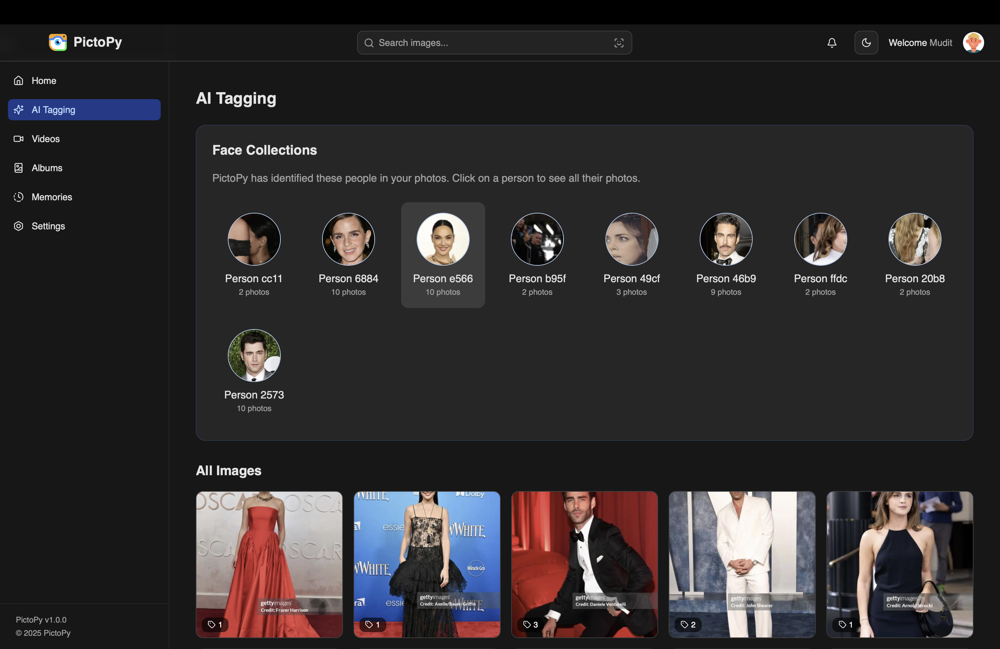
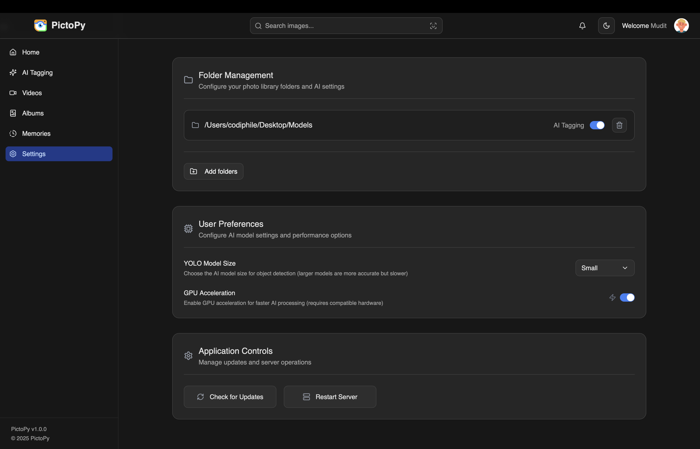

# Screenshots

This section showcases the PictoPy application interface with sample photos featuring people. The screenshots demonstrate the various features and user interface components of the application.

## Main Gallery View

The main gallery displays photos in a grid layout, organized by date with filtering options.

*Main gallery view showing a collection of photos with people, organized in a responsive grid layout*

## AI Tagging Features

The application includes AI-powered features for intelligent photo organization, including automatic object detection, face recognition, and smart clustering.

*AI Tagging interface showing face collections, object detection, and intelligent photo organization*

## Settings Panel

The settings panel allows users to configure directories, preferences, and application behavior.

*Settings panel showing directory configuration and user preferences*

