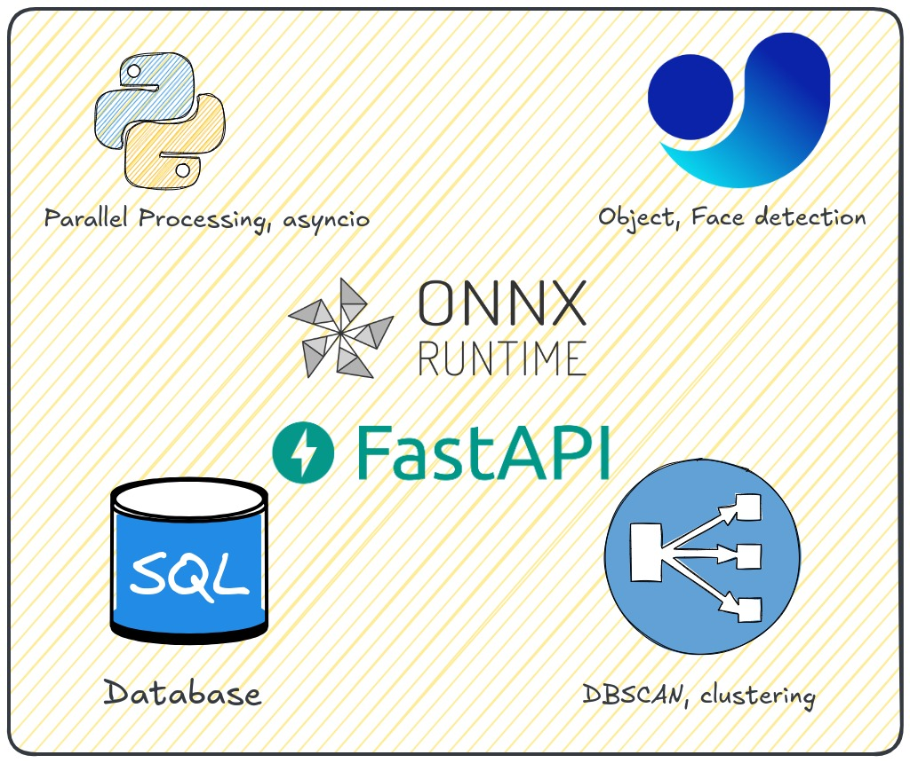

# Architecture
## Frontend

## Backend

    

 
For the backend, we rely on several techstack, our database is served on sqlite while we using parallel processing capabilities of asyncio due to its compatibility
with FastAPI.  Our models are from various sources, we use YOLO models for object and face detection while we use FaceNet for generating the embeddings
of the faces detected. All these models are run on ONNX runtime to avoid heavy dependancies, keeping the application light weight.

We use DBSCAN algorithm to perform clustering for face embeddings generated. All of our database is in SQL (sqlite) and our API calls rely
on queries from the backend.

!!! note "Note"
    We discuss all of the features and configuration of our application in further sections of the documentation. They can be used for both developers
    as well as users who want to use the app. A postman collection has also been added which can be found in our API section.
