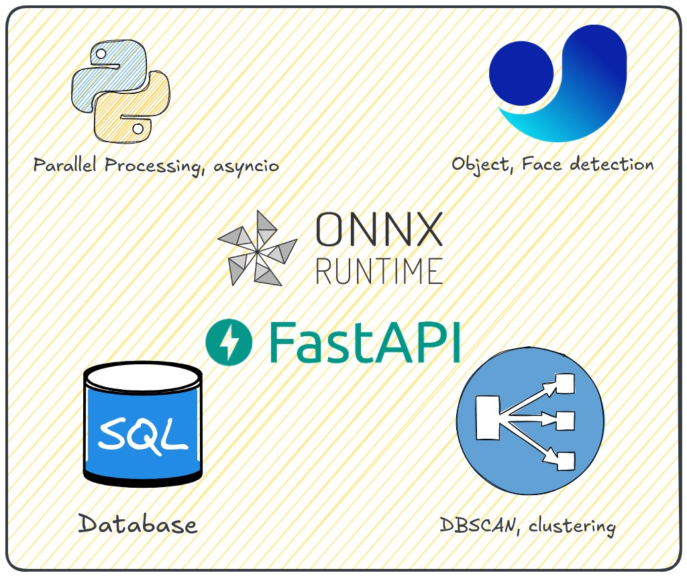
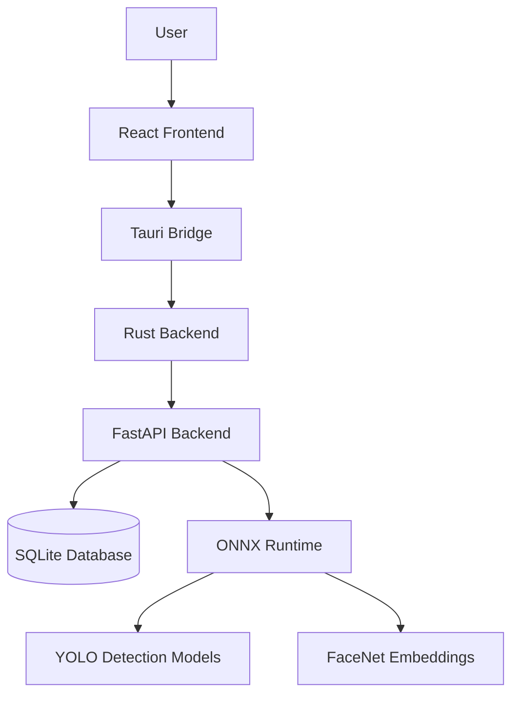
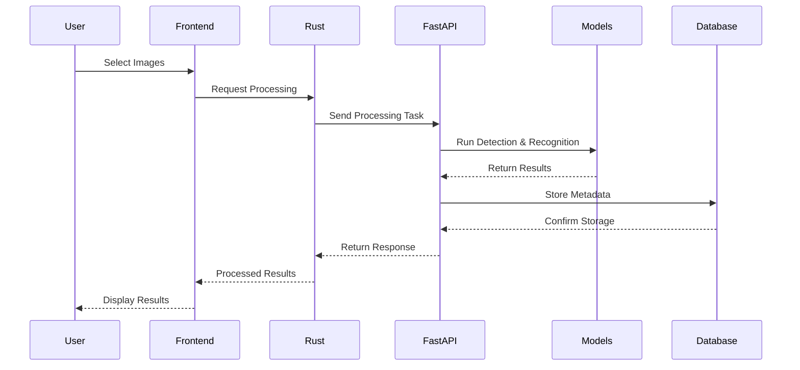

# Architecture

## Frontend

For the frontend of our application, we use Tauri in combination with React. This allows us to create a desktop application with a web-based user interface. React handles the UI components and user interactions, while Tauri provides the bridge between our web-based frontend and Rust-based backend.

Key points:

- Tauri: Enables building the desktop application
- React: Used for creating the user interface
- Rust: Powers the backend, which the frontend communicates with through Tauri's API

This combination allows us to leverage web technologies for the UI while benefiting from Rust's performance and security for core functionalities.

## Backend Python

<!-- markdownlint-disable MD033 -->

    

 
For the backend, we rely on several techstack, our database is served on sqlite while we using parallel processing capabilities of asyncio due to its compatibility
with FastAPI.  Our models are from various sources, we use YOLO models for object and face detection while we use FaceNet for generating the embeddings
of the faces detected. All these models are run on ONNX runtime to avoid heavy dependancies, keeping the application light weight.

We use DBSCAN algorithm to perform clustering for face embeddings generated. All of our database is in SQL (sqlite) and our API calls rely
on queries from the backend.

!!! note "Note"
We discuss all of the features and configuration of our application in further sections of the documentation. They can be used for both developers
as well as users who want to use the app. A postman collection has also been added which can be found in our API section.
 
 

## High Level System Flow

The following diagram illustrates how different components of PictoPy interact with each other.

```mermaid
graph TD

    User[User]

    Frontend[React Frontend]
    Tauri[Tauri Bridge]

    Rust[Rust Backend]

    FastAPI[FastAPI Backend]

    SQLite[(SQLite Database)]

    ONNX[ONNX Runtime]
    YOLO[YOLO Detection Models]
    FaceNet[FaceNet Embeddings]

    User --> Frontend

    Frontend --> Tauri

    Tauri --> Rust

    Rust --> FastAPI

    FastAPI --> SQLite

    FastAPI --> ONNX

    ONNX --> YOLO
    ONNX --> FaceNet
```

## Backend rust (via Tauri)

The Rust backend, integrated through Tauri, is a core component of our application. It leverages Rust's performance and safety features to handle file system operations, provide a secure bridge between the frontend and the local system, and manage OS-level interactions. This backend efficiently manages tasks such as reading and writing image files, extracting metadata, and ensuring secure access to system resources. It communicates with the React frontend through an IPC mechanism, allowing for seamless integration of low-level functionalities with the user interface. This architecture enables high-performance, secure operations on the local system while maintaining a smooth user experience.

## Image Processing Workflow

```mermaid
sequenceDiagram
    participant User
    participant Frontend
    participant Rust
    participant FastAPI
    participant Models
    participant Database

    User->>Frontend: Select Images
    Frontend->>Rust: Request Processing
    Rust->>FastAPI: Send Processing Task
    FastAPI->>Models: Run Detection & Recognition
    Models-->>FastAPI: Return Results
    FastAPI->>Database: Store Metadata
    Database-->>FastAPI: Confirm Storage
    FastAPI-->>Rust: Return Response
    Rust-->>Frontend: Processed Results
    Frontend-->>User: Display Results
```