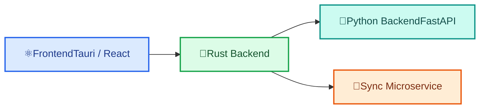
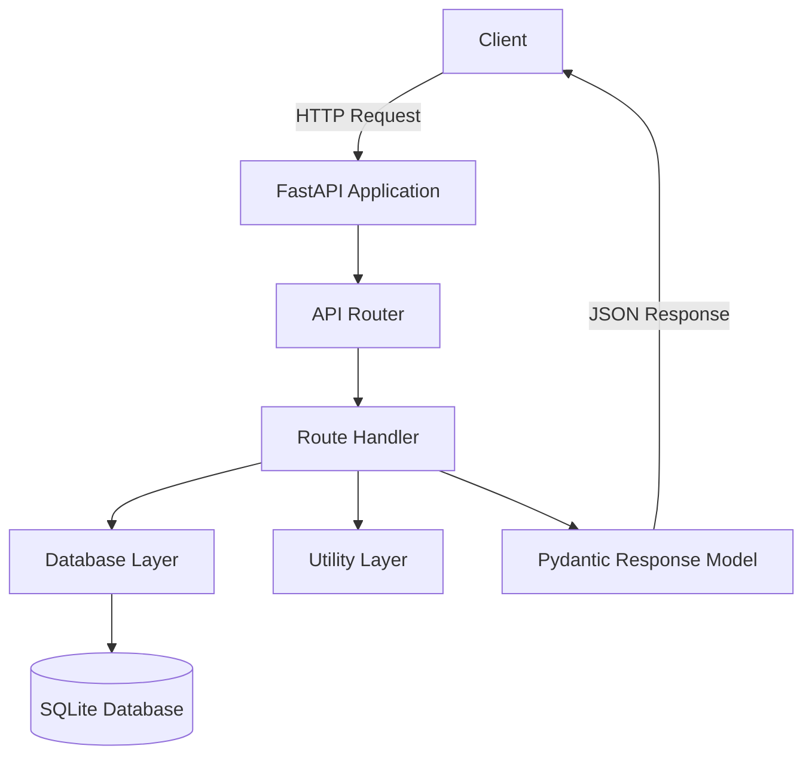
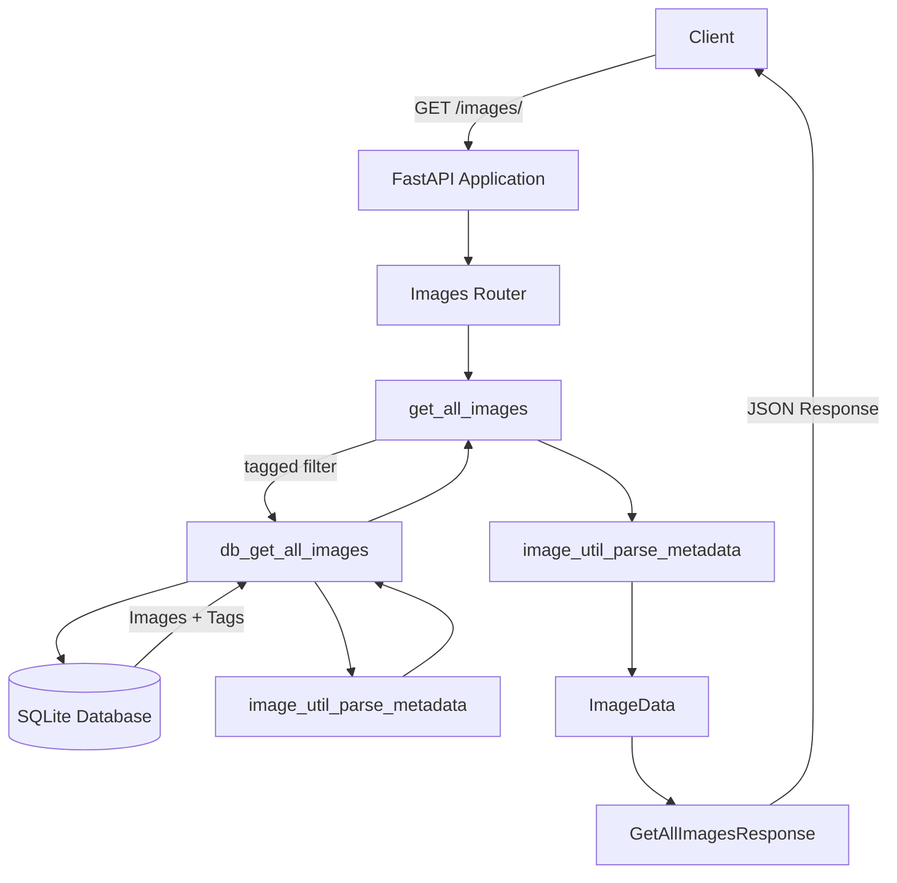

# Architecture

<!-- markdownlint-disable MD033 -->

```mermaid
%%{init: {'flowchart': {'curve': 'basis', 'htmlLabels': true}}}%%
flowchart LR
    A["<div class='arch-node-label'><span class='arch-node-icon'>⚛️</span><span class='arch-node-title'>Frontend</span><span class='arch-node-subtitle'>Tauri / React</span></div>"]:::frontend
    B["<div class='arch-node-label'><span class='arch-node-icon'>🦀</span><span class='arch-node-title'>Rust Backend</span></div>"]:::rust
    C["<div class='arch-node-label'><span class='arch-node-icon'>🐍</span><span class='arch-node-title'>Python Backend</span><span class='arch-node-subtitle'>FastAPI</span></div>"]:::python
    D["<div class='arch-node-label'><span class='arch-node-icon'>🔄</span><span class='arch-node-title'>Sync Microservice</span></div>"]:::sync

    A --> B
    B --> C
    B --> D

    classDef frontend fill:#dbeafe,stroke:#2563eb,color:#1e3a8a,stroke-width:2px
    classDef rust fill:#dcfce7,stroke:#16a34a,color:#14532d,stroke-width:2px
    classDef python fill:#ccfbf1,stroke:#0d9488,color:#134e4a,stroke-width:2px
    classDef sync fill:#ffedd5,stroke:#ea580c,color:#7c2d12,stroke-width:2px

    click A "/frontend/gallery-view/" "Desktop UI layer — Tauri shell with React components"
    click B "/backend/backend_rust/api/" "Native bridge — file I/O, metadata, and Tauri IPC"
    click C "/backend/backend_python/api/" "AI & API layer — FastAPI, ONNX models, and SQLite"
    click D "/Manual_Setup_Guide/#sync-microservice-setup-steps" "Folder sync worker — watches filesystem and keeps the DB in sync"
```

  
 Frontend — Desktop UI (Tauri / React)

  
 Rust Backend — Native bridge &amp; file system

  
 Python Backend — AI processing &amp; REST API

  
 Sync Microservice — Background folder synchronization

<!-- markdownlint-enable MD033 -->

## Frontend

For the frontend of our application, we use Tauri in combination with React. This allows us to create a desktop application with a web-based user interface. React handles the UI components and user interactions, while Tauri provides the bridge between our web-based frontend and Rust-based backend.

Key points:

- Tauri: Enables building the desktop application
- React: Used for creating the user interface
- Rust: Powers the backend, which the frontend communicates with through Tauri's API

This combination allows us to leverage web technologies for the UI while benefiting from Rust's performance and security for core functionalities.

## Backend Python

<!-- markdownlint-disable MD033 -->

    

 

### Core Technologies

For the backend, we rely on several technologies. Our database is served using SQLite, while we use the asynchronous concurrency capabilities of `asyncio` due to its compatibility with FastAPI.

Key technologies include:

- **YOLO:** Used for object and face detection.
- **FaceNet:** Used for generating embeddings of detected faces.
- **ONNX Runtime:** Used to run the models while keeping the application lightweight.
- **DBSCAN:** Used to perform clustering on generated face embeddings.
- **SQLite:** Used for storing application data and metadata.

Our API calls rely on queries from the backend and interact with the SQLite database.

### Semantic Search

For natural-language photo search, we additionally run
[SigLIP2](https://huggingface.co/docs/transformers/en/model_doc/siglip2),
also through ONNX Runtime, following the same distribution pattern as YOLO
and FaceNet.

The system generates a reusable embedding for each photo in the background and embeds search queries at request time.

See [Semantic Search](../backend/backend_python/semantic-search.md) for the full architecture.

## Backend API Architecture

PictoPy's Python backend exposes its HTTP API through FastAPI.

Requests are routed from the application entry point to the corresponding
route module, which interacts with the database and utility layers before
returning a Pydantic response model.

```mermaid
flowchart TD
    A[Client] -->|HTTP Request| B[FastAPI Application]
    B --> C[API Router]
    C --> D[Route Handler]
    D --> E[Database Layer]
    D --> F[Utility Layer]
    E --> G[(SQLite Database)]
    D --> H[Pydantic Response Model]
    H -->|JSON Response| A
```

## Image Retrieval API Flow

The `GET /images/` endpoint provides a concrete example of the backend
request/response flow. The request is routed to `get_all_images()`, which
retrieves image records through `db_get_all_images()`. The database layer
retrieves image and tag data from SQLite and parses stored metadata.
`get_all_images()` invokes `image_util_parse_metadata()` again while
constructing each `ImageData` item before returning the response model.

```mermaid
flowchart TD
    A[Client] -->|GET /images/| B[FastAPI Application]
    B --> C[Images Router]
    C --> D[get_all_images]
    D -->|tagged filter| E[db_get_all_images]
    E --> F[(SQLite Database)]
    F -->|Images + Tags| E
    E --> G1[image_util_parse_metadata]
    G1 --> E
    E --> D
    D --> G2[image_util_parse_metadata]
    G2 --> H[ImageData]
    H --> I[GetAllImagesResponse]
    I -->|JSON Response| A
```

!!! note "Note"
We discuss all of the features and configuration of our application in
further sections of the documentation. They can be used for both
developers as well as users who want to use the app. A postman collection
has also been added which can be found in our API section.
 
 

## Backend rust (via Tauri)

The Rust backend, integrated through Tauri, is a core component of our application. It leverages Rust's performance and safety features to handle file system operations, provide a secure bridge between the frontend and the local system, and manage OS-level interactions. This backend efficiently manages tasks such as reading and writing image files, extracting metadata, and ensuring secure access to system resources. It communicates with the React frontend through an IPC mechanism, allowing for seamless integration of low-level functionalities with the user interface. This architecture enables high-performance, secure operations on the local system while maintaining a smooth user experience.
