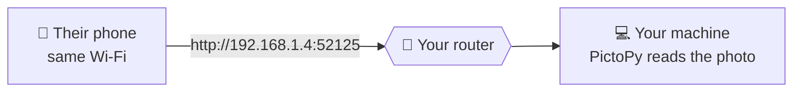
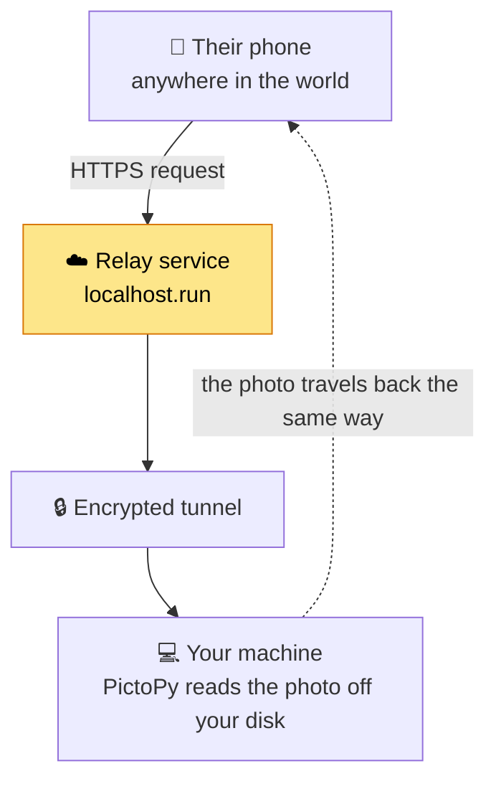

# Sharing Albums

Hand someone a link to one of your albums. They open it in an ordinary browser — no account, no app, nothing to install.

Your photos are never uploaded to PictoPy or to anyone else. They are read off your own disk and sent to whoever opens the link, for as long as you leave the share running.

Two things are true of every share, whichever mode you pick:

- **It only works while PictoPy is running.** Close the app and the link stops working immediately.
- **Nothing is stored anywhere else.** There is no copy on a server to worry about.

## The two modes

When you share an album you choose where the link should work from.

| | This network | Internet |
| --- | --- | --- |
| Who can open it | anyone on your Wi-Fi | anyone with the link |
| Photos pass through | nothing — device to device | a relay service |
| Needs internet | no | yes |
| Speed | your Wi-Fi | your home upload speed |

**This network** is the default and the private one. Use it when the person is in the same house, office or café as you.

**Internet** is for when they are not. It comes with a real trade-off, described below — worth reading once before you use it.

## How "this network" works

The link goes straight from your machine to theirs. Nothing in between, nobody else involved.

This is as private as sharing gets. The only thing that ever sees your photos is the device you sent the link to.

The catch is that both devices must be on the same network, and **some networks refuse to let their own devices talk to each other**. Guest Wi-Fi almost always does this, and plenty of home routers do too. If the link never loads, that is usually why — see [When the link does not load](#when-the-link-does-not-load).

## Internet mode

Internet mode makes your machine reachable from outside by opening a tunnel through a relay service. Your machine still serves every photo; the relay just passes traffic along.

### What this means for your privacy

**The relay can see your photos.** This is the part worth understanding. The connection is encrypted from their phone to the relay, and encrypted again from the relay to you — but the relay sits in the middle and handles your images in readable form. It does not keep them, but it could read them as they pass.

That is the cost of internet mode, and it is why it is never the default.

**Anyone holding the link can open the album.** The link contains a long random code that nobody can guess, but it is not tied to a person. If it gets forwarded, whoever receives it can open the album.

**Chat apps open links by themselves.** Paste the link into WhatsApp, Slack, Discord or iMessage and their servers will fetch it to build a preview — without anyone tapping it. Without a password, that preview request sees your album.

This is why PictoPy turns the password on for you when you choose internet mode. With a password set, anything that fetches the link finds only a password prompt, which reveals nothing at all — not the album name, not how many photos, not a single thumbnail.

You can turn it off. Just know what it changes.

### Speed

Every photo someone views is sent out from your home internet connection, in full, each time. Home connections upload far more slowly than they download, so a large album will feel slower than Google Photos or iCloud — those serve from their own servers, PictoPy serves from your desk.

### Why it works when "this network" does not

Internet mode makes an **outgoing** connection from your machine to the relay. Nothing has to connect *in* to you, so there is no router setting to change and no port to open.

That is also why internet mode still works on networks that block device-to-device traffic: your router is happy to let a connection out, it just will not let two of its own devices talk to each other.

## Passwords

A password can be added in either mode. The person opening the link is asked for it before anything loads.

- The password is optional on your network, and switched on by default for internet mode.
- Ten wrong guesses puts that share on a short cooldown.
- The password protects the album *and* the fact that it exists: the prompt page names nothing about it.

## Stopping a share

A share ends when any of these happens:

- You open the album's share dialog and choose **Stop sharing**.
- The expiry you picked runs out.
- **You close PictoPy.** Every share ends, always.

There is no way for a share to outlive the app, by design.

## When the link does not load

Work through these in order.

**Check they are on your Wi-Fi.** For "this network" mode both devices have to be on the same network. A laptop on Ethernet and a phone on Wi-Fi are often not.

**Try one of the other addresses.** If your machine has more than one network address, PictoPy shows a list. The first is a ranked guess, not a certainty — if it does not load, try the next.

**Check your firewall.** On Windows, a rule created while you were on a *Private* network does not apply once you join a *Public* one, and most Wi-Fi is classified Public. The connection then fails silently.

**Suspect the network itself.** Many networks block devices from talking to each other — called *AP isolation* or *client isolation*. It is near-universal on guest Wi-Fi. Nothing in PictoPy can work around it.

To tell an isolated network from a broken setup, turn on your phone's hotspot, connect your computer to it, and share again. If it works there, PictoPy is fine and the other network was blocking it. **Internet mode also solves this**, since it does not rely on the two devices reaching each other directly.

## For developers

The API, the process layout and the security invariants are documented in [Album Sharing](../backend/backend_python/album-sharing.md).
