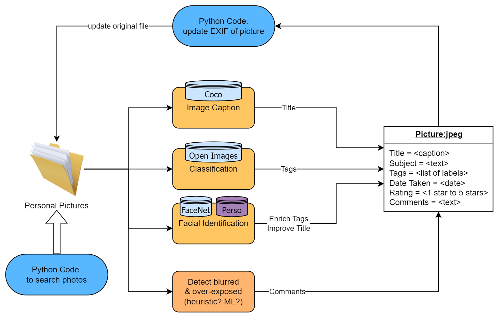

# photo-organizer 🖼️

Different ML and heuristic modules to help organize family photos

## Project
The project is planned to work like this:

 the app of Facial Identification from Streamlit: https://share.streamlit.io/jfthuong/photo-organizer/main/app_facial_recognition.py

## References

1. F. Schroff, D. Kalenichenko, J. Philbin. _FaceNet: A Unified Embedding for Face Recognition and Clustering_, arXiv:1503.03832, 2015. [PDF](https://arxiv.org/pdf/1503.03832)
2. Face Recognition Using Pytorch: [facenet-pytorch](https://github.com/timesler/facenet-pytorch)
